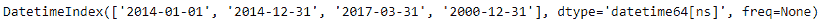
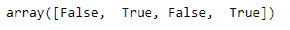
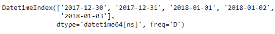
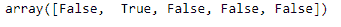

# Python | Pandas datetime index . is _ year _ end

> 原文:[https://www . geesforgeks . org/python-pandas-datetime index-is _ year _ end/](https://www.geeksforgeeks.org/python-pandas-datetimeindex-is_year_end/)

Python 是进行数据分析的优秀语言，主要是因为以数据为中心的 python 包的奇妙生态系统。 ***【熊猫】*** 就是其中一个包，让导入和分析数据变得容易多了。

熊猫 `**DatetimeIndex.is_year_end**`属性是日期是否是一年中最后一天的指标。如果日期是一年的最后一天，它会返回`True`，否则会返回`False`。

> **语法:** DatetimeIndex.is_year_end
> 
> **返回:**包含逻辑值的 numpy 数组。

**示例#1:** 使用`DatetimeIndex.is_year_end`属性检查 DatetimeIndex 对象中的日期是否是一年中的最后一天。

```py
# importing pandas as pd
import pandas as pd

# Create the DatetimeIndex
didx = pd.DatetimeIndex(['2014-01-01', '2014-12-31', '2017-03-31', '2000-12-31'])

# Print the DatetimeIndex
print(didx)
```

**输出:**


现在我们想知道给定 DatetimeIndex 对象中包含的日期是否是一年中的最后一天。

```py
# find if the days are the last day of the year.
didx.is_year_end
```

**输出:**

正如我们在输出中看到的，该函数返回了一个 numpy 数组，其中包含 DatetimeIndex 对象的每个条目的逻辑值。`True`值表示对应日期是一年的最后一天，`False`值表示对应日期不是一年的最后一天。

**示例#2:** 使用`DatetimeIndex.is_year_end`属性检查 DatetimeIndex 对象中的日期是否是一年中的最后一天。

```py
# importing pandas as pd
import pandas as pd

# Create the DatetimeIndex
didx = pd.date_range("2017-12-30", periods = 5)

# Print the DatetimeIndex
print(didx)
```

**输出:**


现在我们想知道给定 DatetimeIndex 对象中包含的日期是否是一年中的最后一天。

```py
# find if the days are the last day of the year.
didx.is_year_end
```

**输出:**

正如我们在输出中看到的，该函数返回了一个 numpy 数组，其中包含 DatetimeIndex 对象的每个条目的逻辑值。`True`值表示对应日期是一年的最后一天，`False`值表示对应日期不是一年的最后一天。