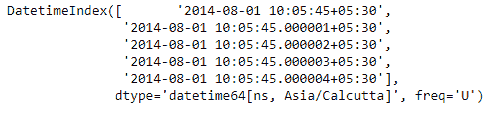
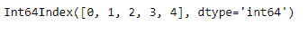
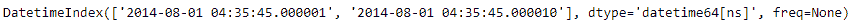
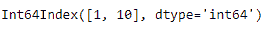

# Python |熊猫约会指数。微秒

> 原文:[https://www . geesforgeks . org/python-pandas-datetime index-微秒/](https://www.geeksforgeeks.org/python-pandas-datetimeindex-microsecond/)

Python 是进行数据分析的优秀语言，主要是因为以数据为中心的 python 包的奇妙生态系统。 ***【熊猫】*** 就是其中一个包，让导入和分析数据变得容易多了。

熊猫 `**DatetimeIndex.microsecond**`属性输出一个索引对象，该对象包含出现在 DatetimeIndex 对象的每个条目中的微秒值。

> **语法:** DatetimeIndex .微秒
> 
> **返回:**包含微秒的索引。

**示例#1:** 使用`DatetimeIndex.microsecond`属性查找 DatetimeIndex 对象中的微秒值。

```
# importing pandas as pd
import pandas as pd

# Create the DatetimeIndex
# Here 'U' represents microseconds
didx = pd.DatetimeIndex(start ='2014-08-01 10:05:45', freq ='U',
                              periods = 5, tz ='Asia/Calcutta')

# Print the DatetimeIndex
print(didx)
```

**输出:**


现在我们想要找到 DatetimeIndex 对象中存在的所有微秒值。

```
# find all the microsecond values
# present in the object
didx.microsecond
```

**输出:**

正如我们在输出中看到的，该函数返回了一个 Index 对象，该对象包含 DatetimeIndex 对象的每个条目中存在的微秒值。

**示例#2:** 使用`DatetimeIndex.microsecond`属性查找 DatetimeIndex 对象中存在的微秒值。

```
# importing pandas as pd
import pandas as pd

# Create the DatetimeIndex
didx = pd.DatetimeIndex(['2014-08-01 10:05:45.000001 + 05:30', 
                         '2014-08-01 10:05:45.000010 + 05:30'])

# Print the DatetimeIndex
print(didx)
```

**输出:**


现在我们想要找到 DatetimeIndex 对象中存在的所有微秒值。

```
# find all the microsecond values 
# present in the object
didx.microsecond
```

**输出:**

正如我们在输出中看到的，该函数返回了一个 Index 对象，该对象包含 DatetimeIndex 对象的每个条目中存在的微秒值。