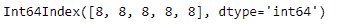
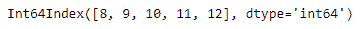

# python | pandas dateindex . month

> 原文:[https://www . geesforgeks . org/python-pandas-datetime index-month/](https://www.geeksforgeeks.org/python-pandas-datetimeindex-month/)

Python 是进行数据分析的优秀语言，主要是因为以数据为中心的 python 包的奇妙生态系统。 ***【熊猫】*** 就是其中一个包，让导入和分析数据变得容易多了。

熊猫 `**DatetimeIndex.month**`属性输出一个索引对象，该对象包含对应于日期时间索引对象中每个条目的数值。它将月份输出为 1 月=1，12 月=12，以及其间每个月的相应数值。

> **语法：** 日期时间索引.月
> 
> **返回:**包含月份的指数。

**示例#1:** 使用`DatetimeIndex.month`属性查找日期时间索引中的月份。

```py
# importing pandas as pd
import pandas as pd

# Create the DatetimeIndex
# Here the 'B' represents Business day frequency
didx = pd.DatetimeIndex(start ='2014-08-01 10:00', freq ='B', 
                           periods = 5, tz ='Asia/Calcutta')

# Print the DatetimeIndex
print(didx)
```

**输出:**


现在，我们希望找到 DatetimeIndex 对象中存在的所有月份值。

```py
# find all the months in the object
didx.month
```

**输出:**

正如我们在输出中看到的，该函数返回了一个 Index 对象，该对象包含了 DatetimeIndex 对象中每个条目对应月份的数值。

**示例 2:** 使用`DatetimeIndex.month`属性查找日期时间索引中的月份。

```py
# importing pandas as pd
import pandas as pd

# Create the DatetimeIndex
# Here the 'M' represents Month end frequency
didx = pd.DatetimeIndex(start ='2014-08-01 10:00', freq ='M',
                           periods = 5, tz ='Asia/Calcutta')

# Print the DatetimeIndex
print(didx)
```

**输出:**


现在，我们希望找到 DatetimeIndex 对象中存在的所有月份值。

```py
# find all the months in the object
didx.month
```

**输出:**

正如我们在输出中看到的，函数返回了一个 Index 对象，其中包含了 DatetimeIndex 对象中每个条目对应月份的数值。