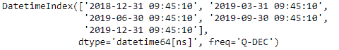
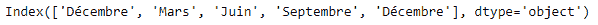
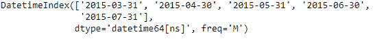
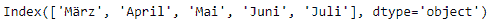

# Python | Pandas datetime index . month _ name()

> 原文:[https://www . geesforgeks . org/python-pandas-datetime index-month _ name/](https://www.geeksforgeeks.org/python-pandas-datetimeindex-month_name/)

Python 是进行数据分析的优秀语言，主要是因为以数据为中心的 python 包的奇妙生态系统。 ***【熊猫】*** 就是其中一个包，让导入和分析数据变得容易多了。

熊猫 `**DatetimeIndex.month_name()**`函数返回指定地区的日期时间索引的月份名称。默认区域设置为“无”，在这种情况下，将以英语返回名称。

> **语法:** DatetimeIndex.month_name(区域设置=无)
> 
> **参数:**
> **地区:**地区确定返回月份名称的语言
> 
> **返回:**月份名称索引

**示例#1:** 使用`DatetimeIndex.month_name()`函数返回 DatetimeIndex 对象中每个条目的月份名称。返回法语地区的月份名称

```
# importing pandas as pd
import pandas as pd

# Create the DatetimeIndex
# Here 'Q' represents quarterly frequency 
didx = pd.DatetimeIndex(start ='2018-11-15 09:45:10', freq ='Q', periods = 5)

# Print the DatetimeIndex
print(didx)
```

**输出:**


现在我们想要返回法语地区的月份名称。

```
# return the names of the month in French
didx.month_name(locale ='French')
```

**输出:**

正如我们在输出中看到的，函数返回了一个包含法语月份名称的 Index 对象。

**示例 2:** 使用`DatetimeIndex.month_name()`函数返回 DatetimeIndex 对象中每个条目的月份名称。返回德语地区的月份名称

```
# importing pandas as pd
import pandas as pd

# Create the DatetimeIndex
# Here 'M' represents monthly frequency 
didx = pd.DatetimeIndex(start ='2015-03-02', freq ='M', periods = 5)

# Print the DatetimeIndex
print(didx)
```

**输出:**


现在我们想返回德语地区的月份名称。

```
# return the names of the month in German
didx.month_name(locale ='German')
```

**输出:**

正如我们在输出中看到的，该函数返回了一个 Index 对象，该对象包含德语区域中的月份名称。