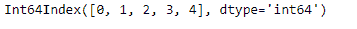
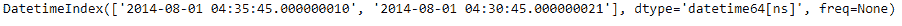
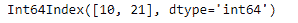

# python | pandas date index .纳秒

> 哎哎哎:# t0]https://www . geeksforgeeks . org/python 熊猫约会指数-纳秒/

Python 是进行数据分析的优秀语言，主要是因为以数据为中心的 python 包的奇妙生态系统。 ***【熊猫】*** 就是其中一个包，让导入和分析数据变得容易多了。

熊猫 `**DatetimeIndex.nanosecond**`属性输出一个索引对象，该对象包含出现在 DatetimeIndex 对象的每个条目中的纳秒值。

> **语法:** DatetimeIndex .纳秒
> 
> **返回:**包含纳秒的索引。

**示例#1:** 使用`DatetimeIndex.nanosecond`属性来查找 DatetimeIndex 对象中存在的纳秒值。

```py
# importing pandas as pd
import pandas as pd

# Create the DatetimeIndex
# Here 'N' represents nanoseconds
didx = pd.DatetimeIndex(start ='2014-08-01 10:05:45', freq ='N',
                              periods = 5, tz ='Asia/Calcutta')

# Print the DatetimeIndex
print(didx)
```

**输出:**


现在我们想要找到 DatetimeIndex 对象中存在的所有纳秒值。

```py
# find all the nanosecond values present in the object
didx.nanosecond
```

**输出:**

正如我们在输出中看到的，该函数返回了一个 Index 对象，该对象包含 DatetimeIndex 对象的每个条目中存在的纳秒值。

**示例#2:** 使用`DatetimeIndex.nanosecond`属性查找 DatetimeIndex 对象中存在的纳秒值。

```py
# importing pandas as pd
import pandas as pd

# Create the DatetimeIndex
didx = pd.DatetimeIndex(['2014-08-01 10:05:45.000000010 + 05:30',
                         '2014-08-01 10:05:45.000000021 + 05:35'])

# Print the DatetimeIndex
print(didx)
```

**输出:**


现在我们想要找到 DatetimeIndex 对象中存在的所有纳秒值。

```py
# find all the nanosecond values present in the object
didx.nanosecond
```

**输出:**

正如我们在输出中看到的，该函数返回了一个 Index 对象，该对象包含 DatetimeIndex 对象的每个条目中存在的纳秒值。