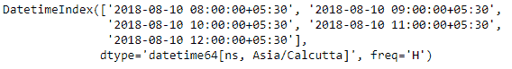
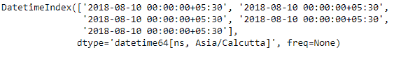
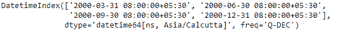
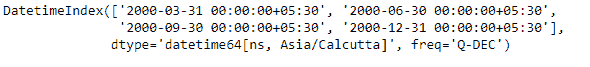

# python | pandas dateindex . normalize()

> 哎哎哎:# t0]https://www . geeksforgeeks . org/python-panda-dateindex-normalize/

Python 是进行数据分析的优秀语言，主要是因为以数据为中心的 python 包的奇妙生态系统。 ***【熊猫】*** 就是其中一个包，让导入和分析数据变得容易多了。

熊猫 `**DatetimeIndex.normalize()**`功能将时间转换为午夜。日期时间的时间部分转换为午夜，即 00:00:00。这在时间不重要的情况下很有用。长度不变。时区不受影响。

> **语法:** DatetimeIndex.normalize()
> 
> **返回:**日期时间索引或序列

**示例#1:** 使用`DatetimeIndex.normalize()`函数来归一化时间。

```py
# importing pandas as pd
import pandas as pd

# Create the DatetimeIndex
# Here 'H' represents hourly frequency 
idx = pd.DatetimeIndex(start ='2018-08-10 08:00', freq ='H', 
                           periods = 5, tz ='Asia/Calcutta')

# Print the DatetimeIndex
print(didx)
```

**输出:**

现在我们希望 DatetimeIndex 对象中存在的所有时间值都被规范化，即它被转换为午夜时间。

```py
# normalize the time.
idx.normalize()
```

**输出:**

正如我们在输出中看到的，该函数已经将对象中的所有时间值转换为午夜时间。

**例 2:** 使用`DatetimeIndex.normalize()`功能将时间归一化。

```py
# importing pandas as pd
import pandas as pd

# Create the DatetimeIndex
# Here 'Q' represents quarter end frequency 
idx = pd.DatetimeIndex(start ='2000-01-15 08:00', freq ='Q', 
                           periods = 4, tz ='Asia/Calcutta')

# Print the DatetimeIndex
print(didx)
```

**输出:**


现在，我们希望 DatetimeIndex 对象中的所有时间值都被规范化，也就是说，它被转换为午夜时间。

```py
# normalize the time.
idx.normalize()
```

**输出:**

正如我们在输出中看到的，函数已经将对象中的所有时间值转换为午夜时间。