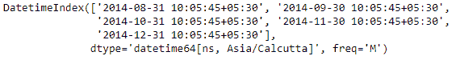
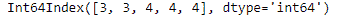
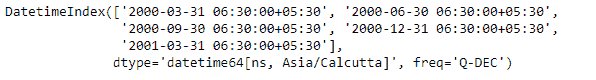
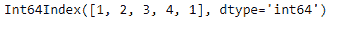

# Python | Pandas datetime index . quarter

> 原文:[https://www . geesforgeks . org/python-pandas-datetime index-quarter/](https://www.geeksforgeeks.org/python-pandas-datetimeindex-quarter/)

Python 是进行数据分析的优秀语言，主要是因为以数据为中心的 python 包的奇妙生态系统。 ***【熊猫】*** 就是其中一个包，让导入和分析数据变得容易多了。

熊猫 `**DatetimeIndex.quarter**`属性输出 DatetimeIndex 对象中每个条目的四分之一日期。

> **语法:**日期时间索引.季度
> 
> **返回:**索引对象

**示例#1:** 使用`DatetimeIndex.quarter`属性查找 DatetimeIndex 对象中每个条目的季度日期。

```py
# importing pandas as pd
import pandas as pd

# Create the DatetimeIndex
# Here 'M' represents Monthly frequency
didx = pd.DatetimeIndex(start ='2014-08-01 10:05:45', freq ='M', 
                              periods = 5, tz ='Asia/Calcutta')

# Print the DatetimeIndex
print(didx)
```

**输出:**


现在，我们想要为 DatetimeIndex 对象中的每个条目找到日期的四分之一。

```py
# find the quarter of date
didx.quarter
```

**输出:**

正如我们在输出中看到的，该函数返回了一个 Index 对象，该对象包含 DatetimeIndex 对象的每个条目的日期的季度值。

**示例#2:** 使用`DatetimeIndex.quarter`属性查找 DatetimeIndex 对象中每个条目的日期季度。

```py
# importing pandas as pd
import pandas as pd

# Create the DatetimeIndex
# Here 'Q' represents Quarterly frequency
didx = pd.DatetimeIndex(start ='2000-01-10 06:30', freq ='Q',
                           periods = 5, tz ='Asia/Calcutta')

# Print the DatetimeIndex
print(didx)
```

**输出:**

现在我们要为 DatetimeIndex 对象中的每个条目找到日期的四分之一。

```py
# find the quarter of date
didx.quarter
```

**输出:**

正如我们在输出中看到的，该函数返回了一个 Index 对象，该对象包含 DatetimeIndex 对象的每个条目的日期的季度值。