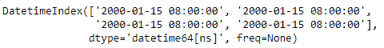
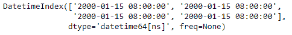

# python | pandas dateindex . round()

> 原文:[https://www . geesforgeks . org/python-pandas-datetime index-round/](https://www.geeksforgeeks.org/python-pandas-datetimeindex-round/)

Python 是进行数据分析的优秀语言，主要是因为以数据为中心的 python 包的奇妙生态系统。 ***【熊猫】*** 就是其中一个包，让导入和分析数据变得容易多了。

Pandas `**DatetimeIndex.round()**`函数将 tz-naive DatetimeIndex 本地化为 tz-aware DatetimeIndex。此方法采用一个时区(tz)幼稚的 DatetimeIndex 对象，并使该时区具有感知能力。它不会将时间移到另一个时区。时区本地化有助于从时区感知对象切换到时区不感知对象。

> **语法：** DatetimeIndex.round（freq， *args， **kwargs）
> 
> **参数:**
> **频率:**频率等级要四舍五入到指数。必须是固定频率，如“S”(秒)而不是“ME”(月末)
> 
> **返回:**日期时间索引或时间增量索引的相同类型的索引，或序列具有相同索引的序列。

**示例#1:** 使用`DatetimeIndex.round()`函数将 DatetimeIndex 对象的数据舍入到指定的频率。

```py
# importing pandas as pd
import pandas as pd

# Create the DatetimeIndex
# Here 'S' represents secondly frequency 
didx = pd.DatetimeIndex(start ='2000-01-15 08:00', 
                           freq ='S', periods = 4)

# Print the DatetimeIndex
print(didx)
```

**输出:**


现在，我们要将 DatetimeIndex 对象的第二个基于频率的频率转换为基于分钟的频率

```py
# convert to the passed frequency
# 'T' represents minute based frequency
didx.round(freq ='T')
```

**输出:**

正如我们在输出中看到的，该函数已经将这些值四舍五入到所需的频率。

**示例 2:** 使用`DatetimeIndex.round()`函数将 DatetimeIndex 对象的数据舍入到指定的频率。

```py
# importing pandas as pd
import pandas as pd

# Create the DatetimeIndex
# Here 'T' represents minutely frequency 
didx = pd.DatetimeIndex(start ='2000-01-15 08:00', 
                           freq ='T', periods = 4)

# Print the DatetimeIndex
print(didx)
```

**输出:**


现在，我们希望将 DatetimeIndex 对象的基于分钟的频率转换为基于小时的频率

```py
# convert to the passed frequency
# Convert minute based frequency to hour based frequency
didx.round(freq ='H')
```

**输出:**

正如我们在输出中看到的，该函数已经将值舍入到所需的频率。