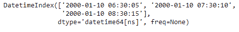

# Python |熊猫约会指标。第二

> 哎哎哎:# t0]https://www . geeksforgeeks . org/python 熊猫约会索引-second/

Python 是进行数据分析的优秀语言，主要是因为以数据为中心的 python 包的奇妙生态系统。 ***【熊猫】*** 就是其中一个包，让导入和分析数据变得容易多了。

熊猫 `**DatetimeIndex.second**`属性输出一个索引对象，该对象包含出现在 DatetimeIndex 对象的每个条目中的第二个值。

> **语法:**日期时间索引.秒
> 
> **返回:**包含秒的索引。

**示例#1:** 使用`DatetimeIndex.second`属性查找 DatetimeIndex 对象中的秒值。

```py
# importing pandas as pd
import pandas as pd

# Create the DatetimeIndex
didx = pd.DatetimeIndex(['2000-01-10 06:30:05', '2000-01-10 07:30:10',
                                                '2000-01-10 08:30:15'])

# Print the DatetimeIndex
print(didx)
```

**输出:**


现在我们想要找到 DatetimeIndex 对象中存在的所有秒值。

```py
<div class="noIdeBtnDiv">
# find all the second values present in the object
didx.second
```