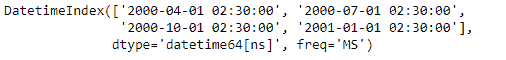
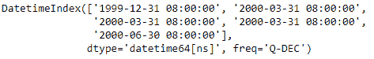

# python | pandas dateindex . snap()

> 哎哎哎:# t0]https://www . geeksforgeeks . org/python 熊猫-date index-snap/

Python 是进行数据分析的优秀语言，主要是因为以数据为中心的 python 包的奇妙生态系统。 ***【熊猫】*** 就是其中一个包，让导入和分析数据变得容易多了。

熊猫 `**DatetimeIndex.snap()**`功能用于将时间戳捕捉到最近的出现频率。该函数接受一个参数，该参数是我们在捕捉 DatetimeIndex 对象的时间戳值时希望应用的频率。

> **语法:** DatetimeIndex.snap(freq)
> 
> **参数:**
> **频率:**频率
> 
> **返回 ：** 日期时间索引

**示例#1:** 使用`DatetimeIndex.snap()`函数根据输入频率将给定的日期时间索引对象转换为最近的出现频率。

```
# importing pandas as pd
import pandas as pd

# Create the DatetimeIndex
# Here 'Q' represents quarter end frequency 
didx = pd.DatetimeIndex(start ='2000-01-15 08:00', freq ='Q',
                          periods = 4, tz ='Asia/Calcutta')

# Print the DatetimeIndex
print(didx)
```

**输出:**


现在，我们希望根据输入将给定的 DatetimeIndex 对象时间戳值转换为最近的频率。

```
# snap the timestamp to the nearest frequency 
didx.snap('MS')
```

**输出:**

正如我们在输出中看到的，函数已经捕捉到了给定 DatetimeIndex 对象中的每个时间戳值。

**示例#2:** 使用`DatetimeIndex.snap()`函数根据输入频率将给定的 DatetimeIndex 对象转换为最近的出现频率。

```
# importing pandas as pd
import pandas as pd

# Create the DatetimeIndex
# Here 'MS' represents month start frequency 
didx = pd.date_range(pd.Timestamp("2000-01-15 08:00"), 
                              periods = 5, freq ='MS')

# Print the DatetimeIndex
print(didx)
```

**输出:**


现在，我们希望根据输入将给定的 DatetimeIndex 对象时间戳值转换为最近的频率。

```
# snap the timestamp to the nearest frequency 
didx.snap('Q')
```

**输出:**

正如我们在输出中看到的，函数已经捕捉到了给定 DatetimeIndex 对象中的每个时间戳值。