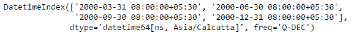
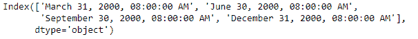
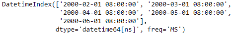
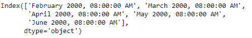

# Python |Pandas DatetimeIndex.strftime（）

> [https://www.geeksforgeeks.org/python-pandas-datetimeindex-strftime/](https://www.geeksforgeeks.org/python-pandas-datetimeindex-strftime/)

Python 是进行数据分析的优秀语言，主要是因为以数据为中心的 python 包的奇妙生态系统。 ***【熊猫】*** 就是其中一个包，让导入和分析数据变得容易多了。

熊猫 `**DatetimeIndex.strftime()**`函数使用指定的日期格式转换为索引。该函数返回由 date_format 指定的格式化字符串的索引，它支持与 python 标准库相同的字符串格式。

> **语法：** 日期时间索引.strftime（date_format）
> 
> **参数:**
> **date_format :** 日期格式字符串(如“%Y-%m-%d”)。
> 
> **返回:**格式化字符串的索引

**示例#1:** 使用`DatetimeIndex.strftime()`函数将给定的日期时间索引对象转换为指定的格式。

```
# importing pandas as pd
import pandas as pd

# Create the DatetimeIndex
# Here 'Q' represents quarter end frequency 
didx = pd.DatetimeIndex(start ='2000-01-15 08:00', freq ='Q',
                            periods = 4, tz ='Asia/Calcutta')

# Print the DatetimeIndex
print(didx)
```

**输出:**


现在我们想把给定的 DatetimeIndex 对象转换成`('%B %d, %Y, %r')`格式。

```
# change the datetime format.
didx.strftime('% B % d, % Y, % r')
```

**输出:**

正如我们在输出中看到的，该函数已经将 DatetimeIndex 对象的格式更改为所需的格式。

**示例#2:** 使用`DatetimeIndex.strftime()`函数将给定的 DatetimeIndex 对象转换为指定的格式。

```
# importing pandas as pd
import pandas as pd

# Create the DatetimeIndex
# Here 'MS' represents month start frequency 
didx = pd.date_range(pd.Timestamp("2000-01-15 08:00"),
                              periods = 5, freq ='MS')

# Print the DatetimeIndex
print(didx)
```

**输出:**


现在我们想把给定的 DatetimeIndex 对象转换成`('%B %Y, %r')`格式。

```
# change the datetime format.
didx.strftime('% B % Y, % r')
```

**输出:**

正如我们在输出中看到的，函数已经将 DatetimeIndex 对象的格式更改为所需的格式。