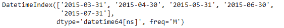
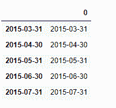

# Python | Pandas datetime index . to _ frame()

> 原文:[https://www . geesforgeks . org/python-pandas-datetime index-to _ frame/](https://www.geeksforgeeks.org/python-pandas-datetimeindex-to_frame/)

Python 是进行数据分析的优秀语言，主要是因为以数据为中心的 python 包的奇妙生态系统。 ***【熊猫】*** 就是其中一个包，让导入和分析数据变得容易多了。

熊猫 `**DatetimeIndex.to_frame()**`函数创建一个包含索引的数据框。默认情况下，DatetimeIndex 对象的标签用作新构造的数据帧的索引。

> **语法:**日期时间索引到框架(索引=真)
> 
> **参数:**
> **索引:**将返回的数据帧的索引设置为原始索引
> 
> **返回:**包含原始索引数据的数据帧。

**示例#1:** 使用`DatetimeIndex.to_frame()`函数从给定的日期时间索引对象创建数据框对象。同样将索引值设置为`False`

```py
# importing pandas as pd
import pandas as pd

# Create the DatetimeIndex
# Here 'S' represents secondly frequency 
didx = pd.DatetimeIndex(start ='2018-11-15 09:45:10', freq ='S', periods = 5)

# Print the DatetimeIndex
print(didx)
```

**输出:**


现在，我们想从 DatetimeIndex 对象中构造一个数据帧。

```py
# construct the DataFrame
didx.to_frame(index = False)
```

**输出:**

正如我们在输出中看到的，该函数返回了一个由 didx DatetimeIndex 对象构造的 DataFrame 对象。

**示例#2:** 使用`DatetimeIndex.to_frame()`函数从给定的 DatetimeIndex 对象创建一个数据框对象。

```py
# importing pandas as pd
import pandas as pd

# Create the DatetimeIndex
# Here 'M' represents monthly frequency 
didx = pd.DatetimeIndex(start ='2015-03-02', freq ='M', periods = 5)

# Print the DatetimeIndex
print(didx)
```

**输出:**


现在，我们想从 DatetimeIndex 对象中构造一个数据帧。

```py
# construct the DataFrame
didx.to_frame(index = True)
```

**输出:**

正如我们在输出中看到的，函数返回了一个由 didx DatetimeIndex 对象构造的 DataFrame 对象。