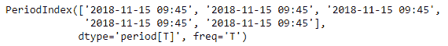
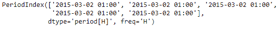

# Python | Pandas datetime index . to _ period()

> 原文:[https://www . geesforgeks . org/python-pandas-datetime index-to _ period/](https://www.geeksforgeeks.org/python-pandas-datetimeindex-to_period/)

Python 是进行数据分析的优秀语言，主要是因为以数据为中心的 python 包的奇妙生态系统。 ***【熊猫】*** 就是其中一个包，让导入和分析数据变得容易多了。

熊猫 `**DatetimeIndex.to_period()**`函数用于将给定的日期时间索引转换为特定频率的周期索引。该函数基本上将 DatetimeIndex 转换为 PeriodIndex。

> **语法:**datetime index . to _ period(freq =无)
> 
> **参数:**
> **频率:**熊猫偏移字符串之一或偏移对象。将被默认推断
> 
> **返回:**周期指数

**示例#1:** 使用`DatetimeIndex.to_period()`函数将 DatetimeIndex 对象的数据转换为 PeriodIndex。

```
# importing pandas as pd
import pandas as pd

# Create the DatetimeIndex
# Here 'S' represents secondly frequency 
didx = pd.DatetimeIndex(start ='2018-11-15 09:45:10', freq ='S', periods = 5)

# Print the DatetimeIndex
print(didx)
```

**输出:**


现在我们要将日期时间索引对象转换为周期索引对象。

```
# cast to PeriodIndex
# 'T' represents minute based frequency
didx.to_period('T')
```

**输出:**

正如我们在输出中看到的，函数已经将 DatetimeIndex 对象铸造为 PeriodIndex 对象。

**示例 2:** 使用`DatetimeIndex.to_period()`函数将 DatetimeIndex 对象的数据转换为 PeriodIndex。

```
# importing pandas as pd
import pandas as pd

# Create the DatetimeIndex
# Here 'T' represents minutely frequency 
didx = pd.DatetimeIndex(start ='2015-03-02 01:15:12', freq ='T', periods = 5)

# Print the DatetimeIndex
print(didx)
```

**输出:**


现在我们要将日期时间索引对象转换为周期索引对象。

```
# cast to PeriodIndex
# 'H' represents hourly frequency
didx.to_period('H')
```

**输出:**

正如我们在输出中看到的，函数已经将 DatetimeIndex 对象铸造为 PeriodIndex 对象。