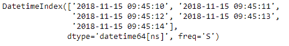
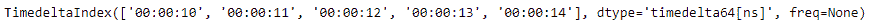
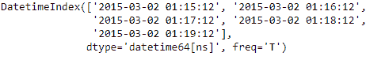
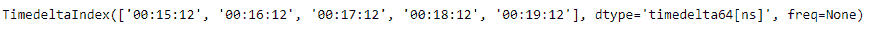

# Python | Pandas datetime index . to _ period delta()

> 原文:[https://www . geesforgeks . org/python-pandas-datetime index-to _ period delta/](https://www.geeksforgeeks.org/python-pandas-datetimeindex-to_perioddelta/)

Python 是进行数据分析的优秀语言，主要是因为以数据为中心的 python 包的奇妙生态系统。 ***【熊猫】*** 就是其中一个包，让导入和分析数据变得容易多了。

熊猫 `**DatetimeIndex.to_perioddelta()**`函数计算时间增量指数，即指数值和以指定频率转换为周期指数的指数之间的差值。它用于矢量化偏移。

> **语法:**datetime index . to _ period delta(freq)
> 
> **参数:**
> **频率:**熊猫的偏移字符串之一或偏移对象。将被默认推断
> 
> **返回**时变指数

**示例#1:** 使用`DatetimeIndex.to_perioddelta()`函数计算指定频率下指数值和转换为周期指数的指数之间差值的时间增量指数

```
# importing pandas as pd
import pandas as pd

# Create the DatetimeIndex
# Here 'S' represents secondly frequency 
didx = pd.DatetimeIndex(start ='2018-11-15 09:45:10', freq ='S', periods = 5)

# Print the DatetimeIndex
print(didx)
```

**输出:**


现在我们要计算时间增量指数，即指数值和转换为周期指数的指数之间的差值

```
# calculate the TimedeltaIndex 
# 'T' represents minute based frequency
didx.to_perioddelta('T')
```

**输出:**

正如我们在输出中所看到的，返回的索引值与转换为 periodIndex 的索引之间的差值。

**示例#2:** 使用`DatetimeIndex.to_perioddelta()`函数计算指定频率下索引值和转换为周期索引的索引之间差异的时间增量索引。

```
# importing pandas as pd
import pandas as pd

# Create the DatetimeIndex
# Here 'T' represents minutely frequency 
didx = pd.DatetimeIndex(start ='2015-03-02 01:15:12', freq ='T', periods = 5)

# Print the DatetimeIndex
print(didx)
```

**输出:**


现在我们要计算时间增量指数，即指数值和转换为周期指数的指数之间的差值

```
# calculate the TimedeltaIndex 
# 'H' represents hourly frequency
didx.to_period('H')
```

**输出:**

在输出中我们可以看到，返回的索引值和索引之间的差值转换为 periodIndex。