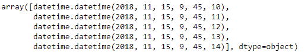
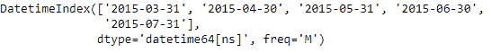
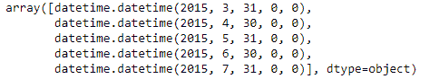

# python | pandas date index . to _ pydatetime()

> 哎哎哎:# t0]https://www . geeksforgeeks . org/python 熊猫约会索引-to_pydatetime/

Python 是进行数据分析的优秀语言，主要是因为以数据为中心的 python 包的奇妙生态系统。 ***【熊猫】*** 就是其中一个包，让导入和分析数据变得容易多了。

Pandas `**DatetimeIndex.to_pydatetime()**`函数返回 DatetimeIndex 作为 datetime.datetime 对象的对象数组。该函数不接受任何输入值。

> **语法：** DatetimeIndex.to_pydatetime（）
> 
> **参数:**无
> 
> **返回:**ndaarray

**示例#1:** 使用`DatetimeIndex.to_pydatetime()`函数将 DatetimeIndex 转换为 datetime.datetime 对象的对象数组。

```py
# importing pandas as pd
import pandas as pd

# Create the DatetimeIndex
# Here 'S' represents secondly frequency 
didx = pd.DatetimeIndex(start ='2018-11-15 09:45:10', freq ='S', periods = 5)

# Print the DatetimeIndex
print(didx)
```

**输出:**


现在我们要将 DatetimeIndex 转换为 datetime.datetime 对象。

```py
# convert to datetime.datetime objects.
didx.to_pydatetime()
```

**输出:**

正如我们在输出中看到的，函数已经将 DatetimeIndex 对象转换为 python datetime.datetime 对象。

**示例 2:** 使用`DatetimeIndex.to_pydatetime()`函数将 DatetimeIndex 转换为 datetime.datetime 对象的对象数组。

```py
# importing pandas as pd
import pandas as pd

# Create the DatetimeIndex
# Here 'M' represents monthly frequency 
didx = pd.DatetimeIndex(start ='2015-03-02', freq ='M', periods = 5)

# Print the DatetimeIndex
print(didx)
```

**输出:**


现在我们要将 DatetimeIndex 转换为 datetime.datetime 对象。

```py
# convert to datetime.datetime objects.
didx.to_pydatetime()
```

**输出:**

在输出中我们可以看到，函数已经将 DatetimeIndex 对象转换为 python datetime.datetime 对象。