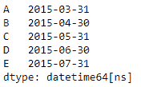
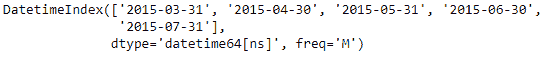
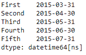

# Python | Pandas datetime index . to _ series()

> 原文:[https://www . geesforgeks . org/python-pandas-datetime index-to _ series/](https://www.geeksforgeeks.org/python-pandas-datetimeindex-to_series/)

Python 是进行数据分析的优秀语言，主要是因为以数据为中心的 python 包的奇妙生态系统。 ***【熊猫】*** 就是其中一个包，让导入和分析数据变得容易多了。

熊猫 `**DatetimeIndex.to_series()**`函数创建一个系列，其索引和值等于索引键，可用于映射，以返回基于索引的索引器。

> **语法:**datetime index . to _ series(keep _ tz = False，index=None，name=None)
> 
> **参数:**
> **keep_tz :** 返回保留时区的数据
> **索引:**结果序列的索引。如果无，默认为原始索引
> **名称:**结果系列的名称。如果为无，则默认为原始索引的名称
> 
> **返回:**系列

**示例#1:** 使用`DatetimeIndex.to_series()`函数从给定的日期时间索引对象创建一个序列对象。同时设置序列的索引值。

```py
# importing pandas as pd
import pandas as pd

# Create the DatetimeIndex
# Here 'S' represents secondly frequency 
didx = pd.DatetimeIndex(start ='2018-11-15 09:45:10', freq ='S', periods = 5)

# Print the DatetimeIndex
print(didx)
```

**输出:**


现在我们想用 DatetimeIndex 对象构造一个序列。

```py
# construct the series
didx.to_series(index =['A', 'B', 'C', 'D', 'E'])
```

**输出:**

正如我们在输出中看到的，函数已经返回了一个从 *didx* DatetimeIndex 对象构造的序列对象。

**示例#2:** 使用`DatetimeIndex.to_series()`函数从给定的 DatetimeIndex 对象创建一个系列对象。同时设置序列的索引值。

```py
# importing pandas as pd
import pandas as pd

# Create the DatetimeIndex
# Here 'M' represents monthly frequency 
didx = pd.DatetimeIndex(start ='2015-03-02', freq ='M', periods = 5)

# Print the DatetimeIndex
print(didx)
```

**输出:**


现在我们想用 DatetimeIndex 对象构造一个序列。

```py
# construct the series
didx.to_series(index =['First', 'Second', 'Third', 'Fourth', 'Fifth'])
```

**输出:**

正如我们在输出中看到的，函数已经返回了一个从 *didx* DatetimeIndex 对象构造的序列对象。