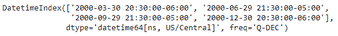
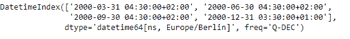

# python | pandas dateindex . tz _ convert()

> 原文:[https://www . geesforgeks . org/python-pandas-datetime index-tz _ convert/](https://www.geeksforgeeks.org/python-pandas-datetimeindex-tz_convert/)

Python 是进行数据分析的优秀语言，主要是因为以数据为中心的 python 包的奇妙生态系统。 ***【熊猫】*** 就是其中一个包，让导入和分析数据变得容易多了。

Pandas `**DatetimeIndex.tz_convert()**`函数将支持 tz 的日期时间索引从一个时区转换到另一个时区。该函数接受一个输入参数，该参数是我们要将当前 DatetimeIndex 对象转换到的时区。

> **语法:** DatetimeIndex.tz_convert(tz)
> 
> **参数:**
> **tz :** 时区为时间。相应的时间戳将被转换为日期时间索引的时区。“无”的时区将转换为世界协调时，并删除时区信息。
> 
> **返回:**归一化:日期时间索引

**示例#1:** 使用`DatetimeIndex.tz_convert()`函数将给定的日期时间索引对象转换为所需的时区。

```
# importing pandas as pd
import pandas as pd

# Create the DatetimeIndex
# Here 'Q' represents quarter end frequency 
didx = pd.DatetimeIndex(start ='2000-01-15 08:00', freq ='Q',
                            periods = 4, tz ='Asia/Calcutta')

# Print the DatetimeIndex
print(didx)
```

**输出:**


现在，我们希望将时区从“亚洲/加尔各答”转换为“美国/中部”

```
# Convert the timezone to 'US / Central'
didx.tz_convert('US/Central')</div>
```

**输出:**


正如我们在输出中看到的，函数已经改变了 didx 对象的时区。

**示例 2:** 使用`DatetimeIndex.tz_convert()`函数将给定的 DatetimeIndex 对象转换为所需的时区。

```
# importing pandas as pd
import pandas as pd

# Create the DatetimeIndex
# Here 'Q' represents quarter end frequency 
didx = pd.DatetimeIndex(start ='2000-01-15 08:00', freq ='Q', 
                           periods = 4, tz ='Asia/Calcutta')

# Print the DatetimeIndex
print(didx)
```

**输出:**


现在，我们希望将时区从“亚洲/加尔各答”转换为“欧洲/柏林”

```
# Convert the timezone to 'Europe / Berlin'
didx.tz_convert('Europe/Berlin')
```

**输出:**

正如我们在输出中看到的，函数已经更改了 *didx* 对象的时区。