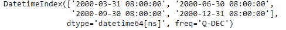
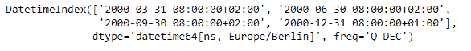
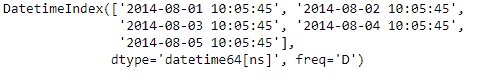
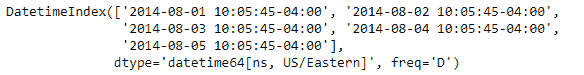

# python | pandas dateindex . tz _ localize()

> 原文:[https://www . geesforgeks . org/python-pandas-datetime index-tz _ local/](https://www.geeksforgeeks.org/python-pandas-datetimeindex-tz_localize/)

Python 是进行数据分析的优秀语言，主要是因为以数据为中心的 python 包的奇妙生态系统。 ***【熊猫】*** 就是其中一个包，让导入和分析数据变得容易多了。

Pandas `**DatetimeIndex.tz_localize()**`函数将 tz-naive DatetimeIndex 本地化为 tz-aware DatetimeIndex。此方法采用一个时区(tz)幼稚的 DatetimeIndex 对象，并使该时区具有感知能力。它不会将时间移到另一个时区。时区本地化有助于从时区感知对象切换到时区不感知对象。

> **语法:**datetime index . tz _ localize(tz，模棱两可='raise '，错误='raise ')
> 
> **参数:**
> **tz :** 时区将时间戳转换为 tz-aware DatetimeIndex。传递“无”将删除保留本地时间的时区信息。
> **模棱两可:** str { '推断'，' NaT '，' raise'}或 bool 数组，默认为' raise'
> **错误:** {'raise '，'要挟' }，默认为' raise '
> 
> **返回:**索引转换到指定时区。

**示例#1:** 使用`DatetimeIndex.tz_localize()`函数将幼稚的 DatetimeIndex 对象转换为具有时区感知的对象。

```py
# importing pandas as pd
import pandas as pd

# Create the DatetimeIndex
# Here 'Q' represents quarter end frequency 
didx = pd.DatetimeIndex(start ='2000-01-15 08:00', freq ='Q', periods = 4)

# Print the DatetimeIndex
print(didx)
```

**输出:**


现在，我们希望将天真的日期时间索引对象转换为时区感知对象

```py
# make timezone aware
didx.tz_localize(tz ='Europe/Berlin')
```

**输出:**

正如我们在输出中看到的，该函数已经将时区感知引入到了 *didx* 对象中。

**示例#2:** 使用`DatetimeIndex.tz_localize()`函数将幼稚的 DatetimeIndex 对象转换为具有时区意识的对象。

```py
# importing pandas as pd
import pandas as pd

# Create the DatetimeIndex
# Here 'D' represents calendar day frequency 
didx = pd.DatetimeIndex(start ='2014-08-01 10:05:45', freq ='D', periods = 5)

# Print the DatetimeIndex
print(didx)
```

**输出:**


现在，我们希望将天真的日期时间索引对象转换为时区感知对象

```py
# make timezone aware
didx.tz_localize(tz ='US/Eastern')
```

**输出:**

正如我们在输出中看到的，该函数已经将时区感知引入到了 *didx* 对象中。