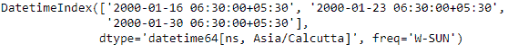
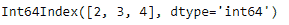
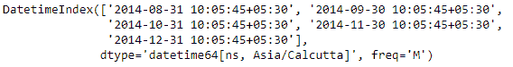
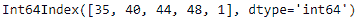

# Python |熊猫约会指数。周

> 哎哎哎:# t0]https://www . geeksforgeeks . org/python 熊猫约会索引-周/

Python 是进行数据分析的优秀语言，主要是因为以数据为中心的 python 包的奇妙生态系统。 ***【熊猫】*** 就是其中一个包，让导入和分析数据变得容易多了。

熊猫 `**DatetimeIndex.week**`属性为 DatetimeIndex 对象的每个条目输出一周的序号值。类似于`DatetimeIndex.week`属性。

> **语法：** 日期时间索引.week
> 
> **返回:**索引对象

**示例#1:** 使用`DatetimeIndex.week`属性查找 DatetimeIndex 对象中每个条目的周序数值。

```
# importing pandas as pd
import pandas as pd

# Create the DatetimeIndex
# Here 'W' represents Weekly frequency
didx = pd.DatetimeIndex(start ='2000-01-10 06:30', freq ='W',
                            periods = 3, tz ='Asia/Calcutta')

# Print the DatetimeIndex
print(didx)
```

**输出:**


现在，我们希望找到 DatetimeIndex 对象中每个条目的周序数值。

```
# find the ordinal value of the week
# for each entries present in the object
didx.week 
```

**输出:**

正如我们在输出中看到的，该函数返回了一个 Index 对象，该对象包含 DatetimeIndex 对象的每个条目中出现的周的序数值。

**示例#2:** 使用`DatetimeIndex.week`属性查找 DatetimeIndex 对象中每个条目的周序数值。

```
# importing pandas as pd
import pandas as pd

# Create the DatetimeIndex
# Here 'M' represents monthly frequency
didx = pd.DatetimeIndex(start ='2014-08-01 10:05:45', freq ='M', 
                               periods = 5, tz ='Asia/Calcutta')

# Print the DatetimeIndex
print(didx)
```

**输出:**


现在，我们希望找到 DatetimeIndex 对象中每个条目的周序数值。

```
# find the ordinal value of the week 
# for each entries present in the object
didx.week
```

**输出:**

正如我们在输出中看到的，该函数返回了一个 Index 对象，该对象包含 DatetimeIndex 对象的每个条目中出现的周的序数值。