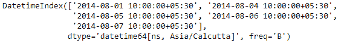
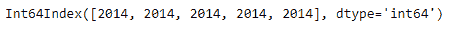
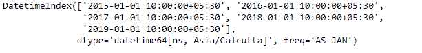

# 蟒蛇|熊猫 DatetimeIndex.year

> 原文:[https://www . geesforgeks . org/python-pandas-datetime index-year/](https://www.geeksforgeeks.org/python-pandas-datetimeindex-year/)

Python 是进行数据分析的优秀语言，主要是因为以数据为中心的 python 包的奇妙生态系统。 ***【熊猫】*** 就是其中一个包，让导入和分析数据变得容易多了。

熊猫 `**DatetimeIndex.year**`属性输出一个包含 Datetime 对象中存在的年份值的索引对象。

> **语法:**日期时间索引.年份
> 
> **回归:**包含年份的指数。

**示例#1:** 使用`DatetimeIndex.year`属性查找日期时间索引中的年份。

```py
# importing pandas as pd
import pandas as pd

# Create the DatetimeIndex
# Here the 'B' represents Business day frequency
didx = pd.DatetimeIndex(start ='2014-08-01 10:00', freq ='B', 
                            periods = 5, tz ='Asia/Calcutta')

# Print the DatetimeIndex
print(didx)
```

**输出:**


现在，我们希望找到 DatetimeIndex 对象中存在的所有年份值。

```py
# find all the years in the object
didx.year
```

**输出:**

正如我们在输出中看到的，函数返回了一个 Index 对象，其中包含了 DatetimeIndex 对象中每个条目的年份值。
&n bsp；
**示例#2:** 使用`DatetimeIndex.year`属性查找日期时间索引中存在的年份。

```py
# importing pandas as pd
import pandas as pd

# Create the DatetimeIndex
# Here the 'AS' represents Year start frequency
didx = pd.DatetimeIndex(start ='2014-08-01 10:00', freq ='AS', 
                             periods = 5, tz ='Asia/Calcutta')

# Print the DatetimeIndex
print(didx)
```

**输出:**


现在，我们希望找到 DatetimeIndex 对象中存在的所有年份值。

```py
# find all the years in the object
didx.year
```

**输出:**

正如我们在输出中看到的，函数已经返回了一个 Index 对象，其中包含了 DatetimeIndex 对象中每个条目的年份值。