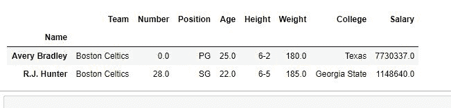
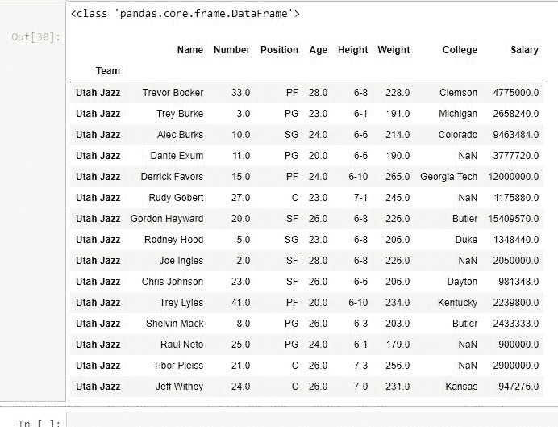
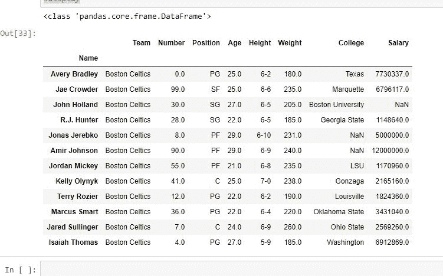

# Python |熊猫使用提取行。loc[]

> 原文:[https://www . geesforgeks . org/python-pandas-extracting-row-using-loc/](https://www.geeksforgeeks.org/python-pandas-extracting-rows-using-loc/)

Python 是进行数据分析的优秀语言，主要是因为以数据为中心的 Python 包的奇妙生态系统。 ***【熊猫】*** 就是其中一个包，让导入和分析数据变得容易多了。

熊猫提供了一种从数据框中检索行的独特方法。 **`DataFrame.loc[]`** 方法是一种只接受索引标签的方法，如果调用者数据框中存在索引标签，则返回行或数据框。

> **语法:**熊猫。DataFrame.loc[]
> 
> **参数:**
> **索引标签:**行索引标签的字符串或字符串列表
> 
> **返回类型:**数据帧或序列，取决于参数

要下载代码中使用的 CSV，点击这里的[。](https://media.geeksforgeeks.org/wp-content/uploads/nba.csv)

**示例#1:** 提取单行

在本例中，将“名称”列作为索引列，然后使用行的索引标签以系列的形式逐个提取两行。

```
# importing pandas package
import pandas as pd

# making data frame from csv file
data = pd.read_csv("nba.csv", index_col ="Name")

# retrieving row by loc method
first = data.loc["Avery Bradley"]
second = data.loc["R.J. Hunter"]

print(first, "\n\n\n", second)
```

**输出:**
如输出图像所示，由于两次都只有一个参数，所以返回了两个序列。


**例 2:** 多个参数

在本例中，将“名称”列作为索引列，然后通过将列表作为参数传递来同时提取两行。

```
# importing pandas package
import pandas as pd

# making data frame from csv file
data = pd.read_csv("nba.csv", index_col ="Name")

# retrieving rows by loc method
rows = data.loc[["Avery Bradley", "R.J. Hunter"]]

# checking data type of rows
print(type(rows))

# display
rows
```

**输出:**
如输出图所示，这次返回值的数据类型是数据帧。这两行都像新的数据框一样被提取和显示。


**示例#3:** 提取具有相同索引的多行

在本例中，团队名称作为索引列，并将一个团队名称传递给。loc 方法检查是否返回了所有具有相同团队名称的值。

```
# importing pandas package
import pandas as pd

# making data frame from csv file
data = pd.read_csv("nba.csv", index_col ="Team")

# retrieving rows by loc method
rows = data.loc["Utah Jazz"]

# checking data type of rows
print(type(rows))

# display
rows
```

**输出:**
如输出图像所示，所有球队名称为“犹他爵士”的行都以数据帧的形式返回。


**示例#4:** 提取两个索引标签之间的行

在本例中，传递了行的两个索引标签，并且返回了这两个索引标签之间的所有行(包括两个索引标签)。

```
# importing pandas package
import pandas as pd

# making data frame from csv file
data = pd.read_csv("nba.csv", index_col ="Name")

# retrieving rows by loc method
rows = data.loc["Avery Bradley":"Isaiah Thomas"]

# checking data type of rows
print(type(rows))

# display
rows
```

**输出:**
如输出图像所示，所有落在传递的两个索引标签之间的行都以数据帧的形式返回。
