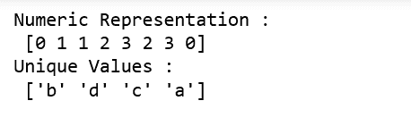
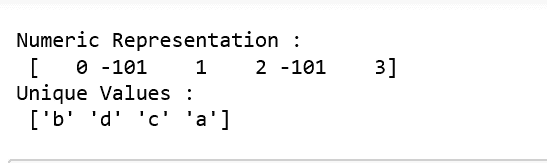
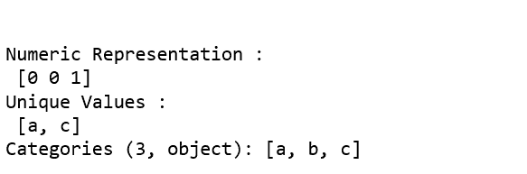

# Python | pandas . factorize()

> 原文:[https://www.geeksforgeeks.org/python-pandas-factorize/](https://www.geeksforgeeks.org/python-pandas-factorize/)

**pandas.factorize()** 方法通过识别不同的值来帮助获得数组的数字表示。这种方法既有`pandas.factorize()`也有`Series.factorize()`。

> **参数:**
> **值:** 1D 序列。
> **排序:**【bool，默认值为 False】排序唯一和无序标签。
> **na _ sentinel:**【int，默认值-1】缺少标记为“未找到”的值。
> 
> **返回:**数组的数字表示

**代码:解释 factorize()方法的工作原理**

```py
# importing libraries
import numpy as np
import pandas as pd
from pandas.api.types import CategoricalDtype

labels, uniques = pd.factorize(['b', 'd', 'd', 'c', 'a', 'c', 'a', 'b'])

print("Numeric Representation : \n", labels)
print("Unique Values : \n", uniques)
```



```py
# sorting the numerics
label1, unique1 = pd.factorize(['b', 'd', 'd', 'c', 'a', 'c', 'a', 'b'], 
                                                           sort = True)

print("\n\nNumeric Representation : \n", label1)
print("Unique Values : \n", unique1)
```


```py
# Missing values indicated
label2, unique2 = pd.factorize(['b', None, 'd', 'c', None, 'a', ], 
                                              na_sentinel = -101)

print("\n\nNumeric Representation : \n", label2)
print("Unique Values : \n", unique2)
```



```py
# When factorizing pandas object; unique will differ 
a = pd.Categorical(['a', 'a', 'c'], categories =['a', 'b', 'c'])

label3, unique3 = pd.factorize(a)

print("\n\nNumeric Representation : \n", label3)
print("Unique Values : \n", unique3)
```

