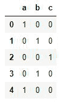
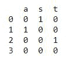
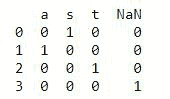
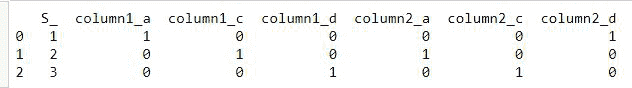

# 蟒蛇熊猫–get _ dummes()方法

> 原文:[https://www . geesforgeks . org/python-pandas-get _ dummies-method/](https://www.geeksforgeeks.org/python-pandas-get_dummies-method/)

**pandas.get_dummies()** 用于数据操作。它将分类数据转换为虚拟变量或指示变量。

> **语法:** pandas.get_dummies(数据，前缀=None，前缀 _sep='_ '，dummy_na=False，列=None，稀疏=False，drop_first=False，dtype=None)
> 
> **参数:**
> 
> *   **数据:**其数据将被操纵。
> *   **前缀:**附加数据框列名的字符串。在数据帧上调用 get_dummies 时，传递一个长度等于列数的列表。默认值为无。
> *   **前缀 _sep:** 如果附加任何前缀，则使用分隔符/分隔符。默认值为“_”
> *   **dummy_na:** 增加一列表示 NaN 值，默认值为 false，如果为 false 则忽略 NaN。
> *   **列:**数据帧中需要编码的列名。默认值为无，如果列为无，则具有对象或类别数据类型的所有列都将被转换。
> *   **稀疏:**它指定伪编码列应该由稀疏数组(真)还是常规 NumPy 数组(假)支持。默认值为假。
> *   **drop_first:** 移除第一个等级，从 k 个分类等级中获得 k-1 个假人。
> *   **数据类型:**新列的数据类型。只允许一种数据类型。默认值为 np.uint8。
> 
> **返回:**数据帧(伪编码数据)

**例 1:**

## 蟒蛇 3

```
import pandas as pd

con = pd.Series(list('abcba'))
print(pd.get_dummies(con))
```

**输出:**



输出

**例 2:**

## 计算机编程语言

```
import pandas as pd
import numpy as np

# list
li = ['s', 'a', 't', np.nan]
print(pd.get_dummies(li))
```

**输出:**



Nan 列不存在，因为默认情况下 dummy_na 为 False

**例 3:** (获取 NaN 列)

## 计算机编程语言

```
import pandas as pd
import numpy as np

# list
li = ['s', 'a', 't', np.nan]
print(pd.get_dummies(li, dummy_na=True))
```

**输出:**



**例 4:**

## 蟒蛇 3

```
import pandas as pd
import numpy as np

# dictionary
diff = pd.DataFrame({'R': ['a', 'c', 'd'],
                     'T': ['d', 'a', 'c'],
                     'S_': [1, 2, 3]})

print(pd.get_dummies(diff, prefix=['column1', 'column2']))
```

**输出:**

