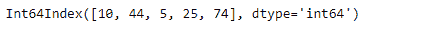
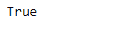
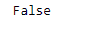

# Python | Pandas Index.all()

> 原文:[https://www.geeksforgeeks.org/python-pandas-index-all/](https://www.geeksforgeeks.org/python-pandas-index-all/)

Python 是进行数据分析的优秀语言，主要是因为以数据为中心的 python 包的奇妙生态系统。 ***【熊猫】*** 就是其中一个包，让导入和分析数据变得容易多了。

熊猫 `**Index.all()**`功能检查索引中的所有元素是否为真。如果未指定轴，则返回一个布尔值。如果索引中的每个值都为真，则返回真。如果索引中的任何值不为真，则返回 false。

**注意:**将 0 视为假值。

> **语法:** Index.all(*args，**kwargs)
> 
> **参数:**
> ***参数:**这些参数将传递给 numpy.all
> ****kwargs :** 这些参数将传递给 numpy.all
> 
> **返回:** all : bool 或 array_like(如果指定了 axis)
> 单元素 array_like 可以转换为 bool。

**示例#1:** 使用`Index.all()`功能检查索引中的所有值是否都为真。

```
# importing pandas as pd
import pandas as pd

# Creating the Index
df = pd.Index([10, 44, 5, 25, 74])

# Print the Index
df
```

**输出:**


让我们检查索引中的所有值是否都是真的。

```
# to check if index values are true or not
df.all()
```

**输出:**

正如我们在输出中看到的，函数已经返回 true，表示索引中的所有值都为 true。

**示例 2:** 使用`Index.all()`功能检查索引中的所有值是否都为真。在索引中，我们有一些 0 值。

```
# importing pandas as pd
import pandas as pd

# Creating the Index
df = pd.Index([17, 69, 33, 5, 0, 74, 0])

# Print the dataframe
df
```

**输出:**


让我们检查索引中的所有值是真的，还是也有任何假的值。

```
# to check if there is any false 
# value present in the index
df.all()
```

**输出:**
