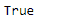
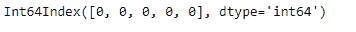
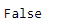

# Python | Pandas Index.any()

> 原文:[https://www.geeksforgeeks.org/python-pandas-index-any/](https://www.geeksforgeeks.org/python-pandas-index-any/)

Python 是进行数据分析的优秀语言，主要是因为以数据为中心的 python 包的奇妙生态系统。 ***【熊猫】*** 就是其中一个包，让导入和分析数据变得容易多了。

熊猫 `**Index.any()**`功能检查索引中的任何元素是否为真。如果未指定轴，则返回一个布尔值。如果索引中的任何一个值为真，则返回真。如果索引中的值都不为真，则返回 false。

**注意:**将 0 视为*假*值。

> **语法:** Index.any(*args，**kwargs)
> 
> **参数:**
> ***参数:**这些参数将传递给`numpy.any`
> ****kwargs :** 这些参数将传递给`numpy.any`
> 
> **返回:**任意:bool 或 array_like(如果指定了 axis)
> 单元素 array_like 可以转换为 bool。

**示例#1:** 使用`Index.any()`功能检查索引中的所有值是否都为真。

```py
# importing pandas as pd
import pandas as pd

# Creating the Index
df = pd.Index([17, 69, 33, 5, 0, 74, 0])

# Print the dataframe
df
```

**输出:**


让我们检查索引中是否有任何值为真，或者是否有所有的假值。

```py
# to check if there is any false 
# value present in the index
df.any()
```

**输出:**

正如我们在输出中看到的，函数已经返回 true，表明 Index 中至少存在一个 true 值。

**示例 2:** 使用`Index.any()`功能检查索引中的任何值是否为真。

```py
# importing pandas as pd
import pandas as pd

# Creating the Index
df = pd.Index([0, 0, 0, 0, 0])

# Print the dataframe
df
```

**输出:**


让我们检查索引中是否有任何值为真，或者是否有所有的假值。

```py
# to check if there is any false
#  value present in the index
df.any()
```

**输出:**
