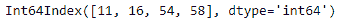
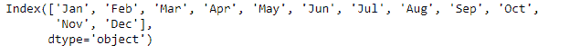

# Python | Pandas index . append()

> 原文:[https://www.geeksforgeeks.org/python-pandas-index-append/](https://www.geeksforgeeks.org/python-pandas-index-append/)

Python 是进行数据分析的优秀语言，主要是因为以数据为中心的 python 包的奇妙生态系统。 ***【熊猫】*** 就是其中一个包，让导入和分析数据变得容易多了。

熊猫 `**Index.append()**`功能用于将单个或一组索引附加在一起。在收集索引的情况下，所有索引都按照传递给`Index.append()`函数的相同顺序追加到原始索引中。该函数返回一个附加索引。

> **语法:** Index.append(其他)
> 
> **参数:**
> **其他:**索引或索引列表/元组
> 
> **返回:**追加:bool 或 array_like(如果指定了 axis)
> 单元素 array_like 可以转换为 bool。

**示例#1:** 使用`Index.append()`函数将单个索引附加到给定的索引。

```
# importing pandas as pd
import pandas as pd

# Creating the first Index
df1 = pd.Index([17, 69, 33, 5, 0, 74, 0])

# Creating the second Index
df2 = pd.Index([11, 16, 54, 58])

# Print the first and second Index
print(df1, "\n", df2)
```

**输出:**




让我们在 df1 的末尾添加 df2 索引。

```
# append df2 at the end of df1
df1.append(df2)
```

**输出:**


正如我们在输出中看到的，第二个索引，即 *df2* 已经被附加在 *df1* 的末尾。

**示例 2:** 使用`Index.append()`函数在给定索引的末尾追加一个索引集合。

```
# importing pandas as pd
import pandas as pd

# Creating the first Index
df1 = pd.Index(['Jan', 'Feb', 'Mar', 'Apr'])

# Creating the second Index
df2 = pd.Index(['May', 'Jun', 'Jul', 'Aug'])

# Creating the third Index
df3 = pd.Index(['Sep', 'Oct', 'Nov', 'Dec'])

# Print the first, second and third Index
print(df1, "\n", df2, "\n", df3)
```

**输出:**


让我们在 *df1* 的末尾加上两个索引 *df2* 和 *df3* 。

```
# We pass df2 and df3 as a list of
# indexes to the append function
df1.append([df2, df3])
```

**输出:**

