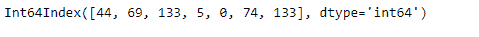

# Python | Pandas index . arg max()

> 原文:[https://www.geeksforgeeks.org/python-pandas-index-argmax/](https://www.geeksforgeeks.org/python-pandas-index-argmax/)

Python 是进行数据分析的优秀语言，主要是因为以数据为中心的 python 包的奇妙生态系统。 ***【熊猫】*** 就是其中一个包，让导入和分析数据变得容易多了。

熊猫 `**Index.argmax()**`函数返回输入索引中最大值的索引。如果我们有一个以上的最大值(即最大值出现不止一次)，那么它返回最大值第一次出现的索引。

> **语法:** Index.argmax(轴=无)
> 
> **参数:**不取任何参数。

**示例#1:** 使用`Index.argmax()`函数查找给定索引中存在的最大值的索引。

```py
# importing pandas as pd
import pandas as pd

# Creating the Index
df = pd.Index([17, 69, 33, 5, 0, 74, 0])

# Print the Index
df
```

**输出:**


让我们找到我们的索引中存在的最大值的索引。

```py
# function to return the index 
# of the maximum value.
df.argmax()
```

**输出:**

```py
5
```

正如我们在输出中看到的，索引中的最大值是 74，它的索引是 5，所以输出是 5。

**例 2:** 当最大值重复多次时，使用`Index.argmax()`函数寻找最大值的索引。

```py
# importing pandas as pd
import pandas as pd

# Creating the Index
df = pd.Index([44, 69, 133, 5, 0, 74, 133])

# Print the Index
df
```

**输出:**


让我们找到最大值的索引。

```py
# We call the argmax() function to 
# find the index of maximum value.
df.argmax()
```

**输出:**

```py
2
```

我们可以在输出中看到，`Index.argmax()`函数返回了最大值第一次出现的索引。