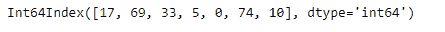
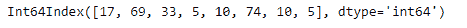

# Python | Pandas index . arg min()

> 原文:[https://www.geeksforgeeks.org/python-pandas-index-argmin/](https://www.geeksforgeeks.org/python-pandas-index-argmin/)

Python 是进行数据分析的优秀语言，主要是因为以数据为中心的 python 包的奇妙生态系统。 ***【熊猫】*** 就是其中一个包，让导入和分析数据变得容易多了。

熊猫 `**Index.argmin()**`函数返回输入索引中最小值的索引。如果我们有一个以上的最小值(即最小值出现不止一次)，那么它返回最小值第一次出现的索引。

> **语法:** Index.argmin(轴=无)
> 
> **参数:**不取任何参数

**示例#1:** 使用`Index.argmin()`函数找到给定指数中最小值的指数。

```py
# importing pandas as pd
import pandas as pd

# Creating the Index
df = pd.Index([17, 69, 33, 5, 0, 74, 10])

# Print the Index
df
```

**输出:**


让我们找到我们指数中最小值的指数。

```py
# function to return the index of the minimum value.
df.argmin()
```

**输出:**

```py
4
```

正如我们在输出中看到的，索引中的最小值是 0，它的索引是 4，所以输出是 4。

**例 2:** 当最小值重复多次时，使用`Index.argmin()`函数寻找最小值的索引。

```py
# importing pandas as pd
import pandas as pd

# Creating the Index
df = pd.Index([17, 69, 33, 5, 10, 74, 10, 5])

# Print the Index
df
```

**输出:**


让我们找到最小值的索引。

```py
# We call the argmin() function to find the index of minimum value.
df.argmin()
```

**输出:**

```py
3
```