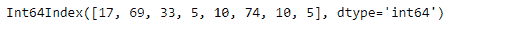
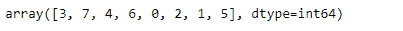
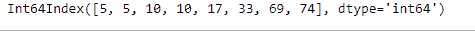
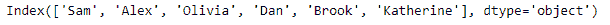
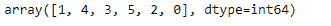

# python | panda index . argsort()

> 哎哎哎:1230【https://www . geeksforgeeks . org/python 熊猫索引-argsort/

Python 是进行数据分析的优秀语言，主要是因为以数据为中心的 python 包的奇妙生态系统。 ***【熊猫】*** 就是其中一个包，让导入和分析数据变得容易多了。

熊猫 `**Index.argsort()**`函数返回对索引进行排序的整数索引。默认情况下，排序顺序已设置为递增顺序。

> **语法:** Index.argsort(*args、**kwargs)
> 
> **参数:**
> ***参数:**传递给 numpy.ndarray.argsort
> *** * kwargs:**传递给 numpy . ndarray . arg sort
> 
> **返回:** numpy.ndarray
> 整数索引，如果用作索引器，将对索引进行排序

**示例#1:** 使用`Index.argsort()`函数找到给定索引排序的索引顺序。

```
# importing pandas as pd
import pandas as pd

# Creating the Index
df = pd.Index([17, 69, 33, 5, 10, 74, 10, 5])

# Print the Index
df
```

**输出:**


让我们找到对索引进行排序的索引顺序。

```
# to find the ordering of indices 
# that would sort the df Index
df.argsort()
```

**输出:**

正如我们在输出中看到的，函数返回了给定索引的排序。我们可以根据订单打印索引来验证这一点。

```
# Printing the Index based on the
# result of the argsort() function
df[df.argsort()]
```

**输出:**

正如我们在输出中看到的，它是按排序顺序打印的。

**示例#2:** 使用`Index.argsort()`函数找到给定索引排序的索引顺序。

```
# importing pandas as pd
import pandas as pd

# Creating the Index
df = pd.Index(['Sam', 'Alex', 'Olivia',
          'Dan', 'Brook', 'Katherine'])

# Print the Index
df
```

**输出:**


让我们找到对索引进行排序的索引顺序。

```
# to find the ordering of indices
# that would sort the df Index
df.argsort()
```

**输出:**

正如我们在输出中看到的，函数返回了给定索引的排序。我们可以根据订单打印索引来验证这一点。

```
# Printing the Index based on the 
# result of the argsort() function
df[df.argsort()]
```

**输出:**

正如我们在输出中看到的，它是按排序顺序打印的。