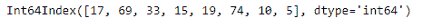
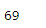
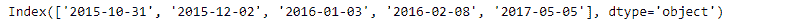

# Python | Pandas index . asof()

> 原文:[https://www.geeksforgeeks.org/python-pandas-index-asof/](https://www.geeksforgeeks.org/python-pandas-index-asof/)

Python 是进行数据分析的优秀语言，主要是因为以数据为中心的 python 包的奇妙生态系统。 ***【熊猫】*** 就是其中一个包，让导入和分析数据变得容易多了。

熊猫 `**Index.asof()**`函数返回从索引返回标签，或者，如果不存在，返回前一个标签。假设索引已排序，如果传递的索引标签在索引中，则返回传递的索引标签，如果传递的索引标签不在索引中，则返回上一个索引标签。

**注意:**该函数仅适用于排序索引。如果没有排序，它将返回错误。

> **语法:** Index.asof(标签)
> 
> **参数:**
> **标签:**该方法返回最新索引标签的标签
> 
> **如果在索引中，则返回:**传递的标签。如果传递的标签不在排序的索引中，则为前一个标签；如果没有这样的标签，则为 NaN。

**示例#1:** 使用`Index.asof()`函数将最新的索引标签返回到传递的索引标签。

```
# importing pandas as pd
import pandas as pd

# Creating the Index
df = pd.Index([17, 69, 33, 15, 19, 74, 10, 5])

# Print the Index
df
```

**输出:**


让我们先对索引标签进行排序

```
# sorting the index labels using the argsort() function
df = df[df.argsort()]

# Lets print the sorted index labels.
df
```

**输出:**


现在我们将在索引中找到最新的标签，最高达 72。

```
# find the latest index label upto 72
df.asof(72)
```

**输出:**

正如我们在输出中看到的，函数已经返回了 69，因为它是之前小于 72 的索引标签。

**示例 2:** 使用`Index.asof()`函数查找到给定日期的索引标签。

```
# importing pandas as pd
import pandas as pd

# Creating the Index
idx = pd.Index(['2015-10-31', '2015-12-02', '2016-01-03',
                              '2016-02-08', '2017-05-05'])

# Print the Index
df
```

**输出:**

索引已经按排序顺序了，所以我们就不排序了。

现在我们将应用`index.asof()`函数找到输入标签的索引标签。

```
# to find the label in the index upto '2016-01-01'
idx.asof('2016-01-01')
```

**输出:**

正如我们在输出中看到的，该函数返回了“2015-12-02”日期，该日期是索引中截至“2016-01-01”的前一个日期