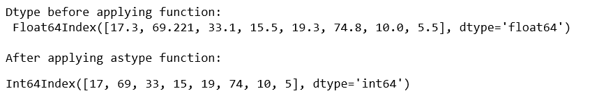
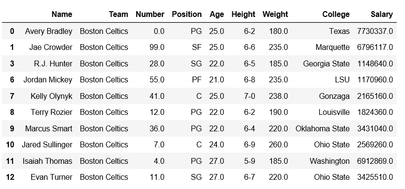
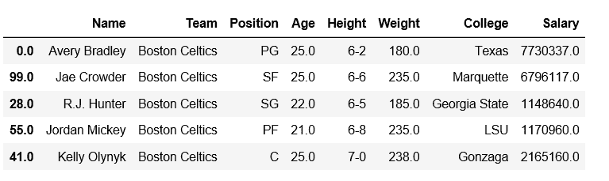
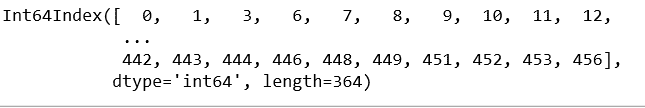

# Python | Pandas index . astype()

> 原文:[https://www.geeksforgeeks.org/python-pandas-index-astype/](https://www.geeksforgeeks.org/python-pandas-index-astype/)

Python 是进行数据分析的优秀语言，主要是因为以数据为中心的 python 包的奇妙生态系统。 ***【熊猫】*** 就是其中一个包，让导入和分析数据变得容易多了。

熊猫 `**Index.astype()**`函数创建一个带有转换为数据类型的值的索引。新索引的类别由数据类型决定。当无法转换时，会引发 ValueError 异常。

> **语法:** Index.astype(数据类型，副本=True)
> 
> **参数:**
> **数据类型:** numpy 数据类型或 pandas 类型
> **副本:**默认情况下，as type 总是返回一个新分配的对象。如果副本设置为假，并且满足数据类型的内部要求，则使用原始数据创建新索引，或者返回原始索引。

**示例#1:** 使用`Index.astype()`函数将索引的数据类型从浮点型更改为整数型。

```
# importing pandas as pd
import pandas as pd

# Creating the Index
df=pd.Index([17.3, 69.221, 33.1, 15.5, 19.3, 74.8, 10, 5.5])

print("Dtype before applying function: \n", df)

print("\nAfter applying astype function:")
# Convert df datatype to 'int64'
df.astype('int64')
```

**输出:**


**示例 2:** 使用`Index.astype()`函数将给定索引的数据类型更改为字符串形式。

```
# importing pandas as pd
import pandas as pd

# Creating the Index
df=pd.Index([17.3, 69.221, 33.1, 15.5, 19.3, 74.8, 10, 5.5])

print("Dtype before applying function: \n", df)

print("\nAfter applying astype function:")
# Convert df datatype to 'int64'
df.astype('str')
```

**输出:**


**例 3:** 我们用`index.astype()`法做点有趣的事。

观察此数据框。


将“数字”列设置为索引。

```
# importing pandas module  
import pandas as pd 

# reading csv file from url  
data = pd.read_csv("https://media.geeksforgeeks.org/wp-content/uploads/nba.csv") 

# dropping null value columns to avoid errors 
data.dropna(inplace = True) 

# Setting Number column as index
data = data.set_index('Number')

# Setting index as None
data.index.names = [None]
data.head(5)
```

**输出:**


现在，让我们将索引转换为整数。

```
# applying astype on index
data.index.astype('int64')
```

**输出:**
