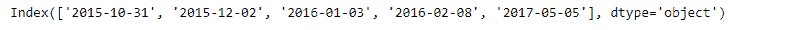
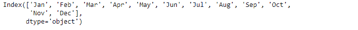

# Python | Pandas index . contains()

> 原文:[https://www.geeksforgeeks.org/python-pandas-index-contains/](https://www.geeksforgeeks.org/python-pandas-index-contains/)

Python 是进行数据分析的优秀语言，主要是因为以数据为中心的 python 包的奇妙生态系统。 ***【熊猫】*** 就是其中一个包，让导入和分析数据变得容易多了。

熊猫 `**Index.contains()**`函数返回一个布尔值，指示提供的键是否在索引中。如果输入值出现在索引中，则返回`True`，否则返回`False`，表示输入值不出现在索引中。

> **语法:**索引.包含(键)
> 
> **参数:**
> **关键:**对象
> 
> **返回:**布尔值

**示例#1:** 使用`Index.contains()`功能检查给定日期是否出现在索引中。

```py
# importing pandas as pd
import pandas as pd

# Creating the Index
idx = pd.Index(['2015-10-31', '2015-12-02', '2016-01-03',
                            '2016-02-08', '2017-05-05'])

# Print the Index
idx
```

**输出:**


让我们检查一下“2016-02-08”是否出现在索引中。

```py
# Check if input date in present or not.
idx.contains('2016-02-08')
```

**输出:**

正如我们在输出中看到的，函数返回了 True，表示该值存在于索引中。

**示例 2:** 使用`Index.contains()`功能检查索引中是否存在输入月份。

```py
# importing pandas as pd
import pandas as pd

# Creating the Index
idx = pd.Index(['Jan', 'Feb', 'Mar', 'Apr', 'May', 'Jun',
               'Jul', 'Aug', 'Sep', 'Oct', 'Nov', 'Dec'])

# Print the Index
idx
```

**输出:**


让我们检查一下“五月”是否出现在索引中

```py
# to check if the input month is
# part of the Index or not.
idx.contains('May')
```

**输出:**
