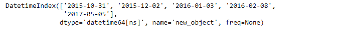

# Python | Pandas index . copy()

> 原文:[https://www.geeksforgeeks.org/python-pandas-index-copy/](https://www.geeksforgeeks.org/python-pandas-index-copy/)

Python 是进行数据分析的优秀语言，主要是因为以数据为中心的 python 包的奇妙生态系统。 ***【熊猫】*** 就是其中一个包，让导入和分析数据变得容易多了。
熊猫 **Index.copy()** 功能复制这个对象。该函数还将新对象的名称和数据类型属性设置为原始对象的名称和数据类型属性。如果我们希望新对象有不同的数据类型，那么我们可以通过设置函数的 dtype 属性来实现。

> **语法:** Index.copy(name=None，deep=False，dtype=None，**kwargs)
> **参数:**
> **name :** string，可选
> **deep :** boolean，默认 False
> **dtype:**numpy dtype 或 pandas type
> **Returns:**copy:Index

**注意:**在大多数情况下，使用 deep 应该没有功能上的区别，但是如果 deep 被通过，它将尝试 deepcopy。
**示例#1:** 使用 Index.copy()函数将 Index 值复制到新对象，并将新对象的数据类型更改为‘int64’

## 蟒蛇 3

```py
# importing pandas as pd
import pandas as pd

# Creating the Index
idx = pd.Index([17.3, 69.221, 33.1, 15.5, 19.3, 74.8, 10, 5.5])

# Print the Index
idx
```

**输出:**


让我们创建一个具有“int64”数据类型的对象的副本。

## 蟒蛇 3

```py
# Change the data type of newly
# created object to 'int64'
idx.copy(dtype ='int64')
```

**输出:**


正如我们在输出中看到的，该函数返回了一个带有“int64”数据类型的原始索引的副本。

**例 2:** 使用 Index.copy()函数复制原对象。还要设置新对象的 name 属性，并将字符串数据类型转换为“datetime”类型。

## 蟒蛇 3

```py
# importing pandas as pd
import pandas as pd

# Creating the Index
idx = pd.Index(['2015-10-31', '2015-12-02', '2016-01-03',
                             '2016-02-08', '2017-05-05'])

# Print the Index
idx
```

**输出:**


让我们复制原始对象。

## 蟒蛇 3

```py
# to make copy and set data type in the datetime format.
idx_copy = idx.copy(dtype ='datetime64')

# Print the newly created object
idx_copy
```

**输出:**



正如我们在输出中所看到的，新对象具有日期时间格式的数据，并且它的 name 属性也被设置了。