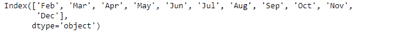
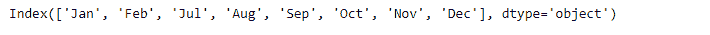

# Python | Pandas index . delete()

> 原文:[https://www.geeksforgeeks.org/python-pandas-index-delete/](https://www.geeksforgeeks.org/python-pandas-index-delete/)

Python 是进行数据分析的优秀语言，主要是因为以数据为中心的 python 包的奇妙生态系统。 ***【熊猫】*** 就是其中一个包，让导入和分析数据变得容易多了。

熊猫 `**Index.delete()**`函数返回一个新的对象，删除传递的位置。我们可以通过列表的形式传递多个要删除的位置。

> **语法:**索引.删除(loc)
> 
> **参数:**
> **loc :** 标量/指数列表
> 
> **返回:** new_index : Index

**示例#1:** 使用`Index.delete()`功能删除索引中的第一个值。

```
# importing pandas as pd
import pandas as pd

# Creating the Index
idx = pd.Index(['Jan', 'Feb', 'Mar', 'Apr', 'May', 'Jun',
                'Jul', 'Aug', 'Sep', 'Oct', 'Nov', 'Dec'])

# Print the Index
idx
```

**输出:**


让我们删除“一月”这个月。它出现在第 0 个索引处，因此我们将 0 作为参数传递给函数。

```
# delete the first label in the given Index
idx.delete(0)
```

**输出:**

正如我们在输出中看到的，函数返回了一个对象，其第一个标签被删除。

**示例 2:** 使用`Index.delete()`功能删除索引中的多个标签。

```
# importing pandas as pd
import pandas as pd

# Creating the Index
idx = pd.Index(['Jan', 'Feb', 'Mar', 'Apr', 'May', 'Jun',
                'Jul', 'Aug', 'Sep', 'Oct', 'Nov', 'Dec'])

# Print the Index
idx
```

**输出:**


让我们从索引中删除第二、第三、第四和第五个索引。我们将一个要删除的值列表传递给函数。

```
# to delete values present at 2nd, 3rd, 4th and 5th place in the Index.
idx.delete([2, 3, 4, 5])
```

**输出:**

如我们所见，索引中传递值对应的标签已被删除。