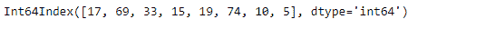
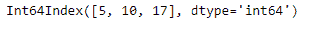
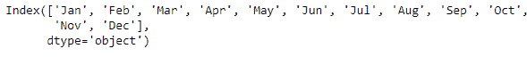
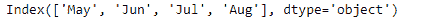
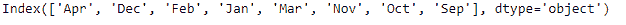

# Python | Pandas index . difference()

> 原文:[https://www . geesforgeks . org/python-pandas-index-difference/](https://www.geeksforgeeks.org/python-pandas-index-difference/)

Python 是进行数据分析的优秀语言，主要是因为以数据为中心的 python 包的奇妙生态系统。 ***【熊猫】*** 就是其中一个包，让导入和分析数据变得容易多了。
熊猫 **Index.difference()** 函数返回一个新的 Index，其中包含索引中不存在的元素。
如果可以排序，该功能会自动对输出进行排序。

> **语法:**Index . difference(other)
> **参数:**
> **other :** Index 或类似数组的
> **返回:** difference : Index

**示例#1:** 使用 Index.difference()函数，找到给定索引与类似数组的对象的集合差。

## 蟒蛇 3

```
# importing pandas as pd
import pandas as pd

# Creating the Index
idx = pd.Index([17, 69, 33, 15, 19, 74, 10, 5])

# Print the Index
idx
```

**输出:**



让我们用一个类似数组的对象
找到给定索引的集合差

## 蟒蛇 3

```
# find the set difference of this Index
# with the passed array object.
idx.difference([69, 33, 15, 74, 19])
```

**输出:**



正如我们在输出中看到的，该函数返回了一个对象，该对象只包含 idx Index 唯一的值。
注意，输出对象的元素按递增顺序排序。

**例 2:** 用 Index.difference()函数求两个指标的集合差。

## 蟒蛇 3

```
# importing pandas as pd
import pandas as pd

# Creating the first Index
idx1 = pd.Index(['Jan', 'Feb', 'Mar', 'Apr', 'May', 'Jun',
                 'Jul', 'Aug', 'Sep', 'Oct', 'Nov', 'Dec'])

# Creating the second Index
idx2 = pd.Index(['May', 'Jun', 'Jul', 'Aug'])

# Print the first and second Index
print(idx1, "\n", idx2)
```

**输出:**





现在，让我们找出两个索引之间的集合差异。

## 蟒蛇 3

```
# to find the set difference
idx1.difference(idx2)
```

**输出:**



该功能返回了 *idx1* 和 *idx2* 的设定差。它只包含 *idx1* 指数独有的值。请注意，输出没有排序。