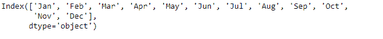
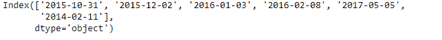
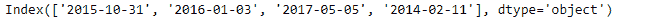

# Python | Pandas index . drop()

> 原文:[https://www.geeksforgeeks.org/python-pandas-index-drop/](https://www.geeksforgeeks.org/python-pandas-index-drop/)

Python 是进行数据分析的优秀语言，主要是因为以数据为中心的 python 包的奇妙生态系统。 ***【熊猫】*** 就是其中一个包，让导入和分析数据变得容易多了。

熊猫 `**Index.drop()**`功能创建新的索引，删除传递的标签列表。该函数类似于`Index.delete()`，除了在该函数中我们传递标签名称而不是位置值。

> **语法:** Index.drop(标签，错误='raise ')
> 
> **参数:**
> **标签:**阵列状
> **错误:** { '忽略'，'提高' }，默认为'提高'
> 如果'忽略'，抑制错误并删除现有标签。
> 
> **返回:**下降:指数
> T3】上升:键错误。如果在所选轴中没有找到所有标签

**示例#1:** 使用`Index.drop()`功能从索引中删除传递的标签。

```
# importing pandas as pd
import pandas as pd

# Creating the Index
idx = pd.Index(['Jan', 'Feb', 'Mar', 'Apr', 'May', 'Jun',
                'Jul', 'Aug', 'Sep', 'Oct', 'Nov', 'Dec'])

# Print the Index
idx
```

**输出:**


让我们从指数中去掉“1 月”和“12 月”。

```
# Passing a list containing the labels
# to be dropped from the Index
idx.drop(['Jan', 'Dec'])
```

**输出:**


正如我们在输出中看到的，该函数返回了一个不包含我们传递给`Index.drop()`函数的标签的对象。

**示例 2:** 使用`Index.drop()`函数在索引中删除包含日期时间数据的标签列表。

```
# importing pandas as pd
import pandas as pd

# Creating the first Index
idx = pd.Index(['2015-10-31', '2015-12-02', '2016-01-03',
                '2016-02-08', '2017-05-05', '2014-02-11'])

# Print the Index
idx
```

**输出:**


现在，让我们从索引中删除一些日期。

```
# Passing the values to be dropped from the Index
idx.drop(['2015-12-02', '2016-02-08'])
```

**输出:**

正如我们在输出中看到的，`Index.drop()`函数已经从索引中删除了传递的值。