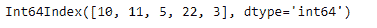
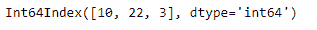

# Python | Pandas index . drop _ duplicates()

> 原文:[https://www . geesforgeks . org/python-pandas-index-drop _ duplicates/](https://www.geeksforgeeks.org/python-pandas-index-drop_duplicates/)

Python 是进行数据分析的优秀语言，主要是因为以数据为中心的 python 包的奇妙生态系统。 ***【熊猫】*** 就是其中一个包，让导入和分析数据变得容易多了。

熊猫 `**Index.drop_duplicates()**`函数返回删除了重复值的索引。该函数提供了选择保留哪个重复值的灵活性。我们可以从列表中删除所有重复的值，或者保留第一次/最后一次出现的重复值。

> **语法:** Index.drop_duplicates(标签，错误='raise ')
> 
> **参数:**
> **保留:** { '第一个'，'最后一个'，False}，默认'第一个'
> **- >** '第一个' :除去第一个出现的重复项。
> **- >** “最后”:除去最后出现的重复项。
> **- >** 假:删除所有重复项。
> 
> **返回:**已消除重复数据:索引

**示例#1:** 使用`Index.drop_duplicates()`功能删除重复值的所有出现，除了第一次出现。

```py
# importing pandas as pd
import pandas as pd

# Creating the Index
idx = pd.Index([10, 11, 5, 5, 22, 5, 3, 11])

# Print the Index
idx
```

**输出:**


让我们删除索引中除第一个重复值以外的所有重复值。

```py
# drop all duplicate occurrences of the
# labels and keep the first occurrence
idx.drop_duplicates(keep ='first')
```

**输出:**

正如我们在输出中看到的，`Index.drop_duplicate()`函数已经删除了索引中标签的重复出现。

**示例 2:** 使用`Index.drop_duplicate()`功能删除标签的所有重复出现。不要在索引中保留任何重复的值。

```py
# importing pandas as pd
import pandas as pd

# Creating the Index
idx = pd.Index([10, 11, 5, 5, 22, 5, 3, 11])

# Print the Index
idx
```

**输出:**


让我们删除索引中所有出现的重复值。

```py
# drop all duplicate occurrences of the labels
idx.drop_duplicates(keep = False)
```

**输出:**

正如我们在输出中看到的，所有重复的值都从索引中删除了。