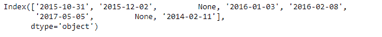
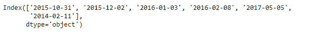
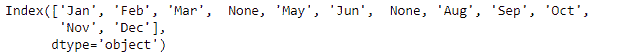

# python | panda index . drop na()

> 哎哎哎:# t0]https://www . geeksforgeeks . org/python 熊猫索引-dropna/

Python 是进行数据分析的优秀语言，主要是因为以数据为中心的 python 包的奇妙生态系统。 ***【熊猫】*** 就是其中一个包，让导入和分析数据变得容易多了。
熊猫 **Index.dropna()** 函数返回无 NA/NaN 值的指数。所有丢失的值都被移除，并返回一个新的对象，该对象中不存在任何 NaN 值。

> **语法:**Index . dropna(how = ' any ')
> **参数:**
> **how :** {'any '，' all'}，默认为' any'
> 如果 Index 是 MultiIndex，当任意或所有级别都是 NaN 时，删除该值。
> **返回:**有效:索引

**示例#1:** 使用 Index.dropna()函数从包含日期时间数据的给定索引中移除所有缺失的值。

## 蟒蛇 3

```py
# importing pandas as pd
import pandas as pd

# Creating the Index
idx = pd.Index(['2015-10-31', '2015-12-02', None, '2016-01-03',
                '2016-02-08', '2017-05-05', None, '2014-02-11'])

# Print the Index
idx
```

**输出:**



让我们从索引中删除所有的 NaN 值。

## 蟒蛇 3

```py
# drop all missing values.
idx.dropna(how ='all')
```

**输出:**



正如我们在输出中看到的，Index.dropna()函数已经删除了所有缺失的值。

**例 2:** 使用 Index.dropna()函数删除索引中所有缺失的值。索引包含字符串类型数据。

## 蟒蛇 3

```py
# importing pandas as pd
import pandas as pd

# Creating the Index
idx = pd.Index(['Jan', 'Feb', 'Mar', None, 'May', 'Jun',
                None, 'Aug', 'Sep', 'Oct', 'Nov', 'Dec'])

# Print the Index
idx
```

**输出:**



让我们去掉所有缺失的值。

## 蟒蛇 3

```py
# drop the missing values
idx.dropna(how ='any')
```

**输出:**


正如我们在输出中看到的，所有缺失的月份值都被删除了。