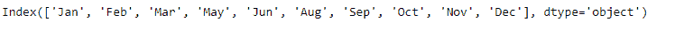
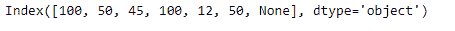
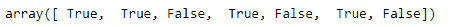

# Python | Pandas index . duplicated()

> 原文:[https://www . geesforgeks . org/python-pandas-index-replicated/](https://www.geeksforgeeks.org/python-pandas-index-duplicated/)

Python 是进行数据分析的优秀语言，主要是因为以数据为中心的 python 包的奇妙生态系统。 ***【熊猫】*** 就是其中一个包，让导入和分析数据变得容易多了。

熊猫 `**Index.duplicated()**`功能表示重复的索引值。重复的值在结果数组中表示为*真*值。可以指示所有重复项，除第一个重复项外的所有重复项，或者除最后一个重复项外的所有重复项。

> **语法:**index . duplicated(keep = ' first ')
> 
> **参数:**
> **保留:** { '第一个'，'最后一个'，'假' }，默认'第一个'
> 一组重复项中的一个或多个值标记为缺失。
> **- >** “第一个”:除了第一次出现外，将重复项标记为真。
> **- >** “最后”:除最后一次出现外，将重复项标记为“真”。
> **- >** 假:将所有重复标记为真。
> 
> **返回:** numpy.ndarray

**示例#1:** 使用`Index.duplicated()`函数指示索引中除第一个值之外的所有重复值。

```py
# importing pandas as pd
import pandas as pd

# Creating the Index
idx = pd.Index(['Labrador', 'Beagle', 'Labrador', 
                      'Lhasa', 'Husky', 'Beagle'])

# Print the Index
idx
```

**输出:**


让我们看看索引中的值是重复值还是唯一值。

```py
# Identify the duplicated values except the first
idx.duplicated(keep ='first')
```

**输出:**

正如我们在输出中看到的，`Index.duplicated()`函数已经将重复值的所有出现标记为`True`除了第一次出现。

**示例 2:** 使用`Index.duplicated()`功能识别所有重复值。这里所有的重复值将被标记为`True`

```py
# importing pandas as pd
import pandas as pd

# Creating the Index
idx = pd.Index([100, 50, 45, 100, 12, 50, None])

# Print the Index
idx
```

**输出:**


让我们确定索引中所有重复的值。

**注:**我们在指数中有`NaN`值。

```py
# Identify all duplicated occurrence of values
idx.duplicated(keep = False)
```

**输出:**


该函数已将所有重复值标记为“真”。它还将`NaN`值的单次出现视为唯一，并将其标记为假。