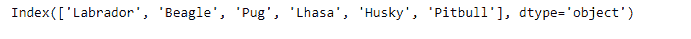
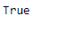

# Python | Pandas index . equals()

> 原文:[https://www.geeksforgeeks.org/python-pandas-index-equals/](https://www.geeksforgeeks.org/python-pandas-index-equals/)

Python 是进行数据分析的优秀语言，主要是因为以数据为中心的 python 包的奇妙生态系统。 ***【熊猫】*** 就是其中一个包，让导入和分析数据变得容易多了。

熊猫 `**Index.equals()**`函数确定两个索引对象是否包含相同的元素。如果它们包含相同的元素，则函数返回`True`，否则函数返回`False`，表示两个索引中包含的值不同。

> **语法:** Index.equals(其他)
> 
> **参数:**
> **其他:**指标
> 
> **返回:**布尔值

**示例#1:** 使用`Index.equals()`功能检查两个索引是否包含相同的元素

```
# importing pandas as pd
import pandas as pd

# Creating the first Index
idx1 = pd.Index(['Labrador', 'Beagle', 'Labrador', 'Lhasa', 'Husky', 'Beagle'])

# Creating the second Index
idx2 = pd.Index(['Labrador', 'Beagle', 'Pug', 'Lhasa', 'Husky', 'Pitbull'])

# Print the first and second Index
print(idx1, "\n", idx2)
```

**输出:**



让我们检查一下这两个索引是否相等。

```
# Checking the equality of the two Indexes
idx1.equals(idx2)
```

**输出:**


正如我们在输出中看到的那样，`Index.equals()`函数返回了`False`，表示索引不相等。

**例 2:** 使用`Index.equals()`功能检查两个指标是否相等。

```
# importing pandas as pd
import pandas as pd

# Creating the first Index
idx1 = pd.Index(['Jan', 'Feb', 'Mar', 'Apr', 'May', 'Jun',
                 'Jul', 'Aug', 'Sep', 'Oct', 'Nov', 'Dec'])

# Creating the second Index
idx2 = pd.Index(['Jan', 'Feb', 'Mar', 'Apr', 'May', 'Jun',
                 'Jul', 'Aug', 'Sep', 'Oct', 'Nov', 'Dec'])

# Print the first and second Index
print(idx1, "\n", idx2)
```

**输出:**


让我们检查一下这两个指数是否相等。

```
# test the equality
idx1.equals(idx2)
```

**输出:**

函数返回`True`，表示两个指标相等。