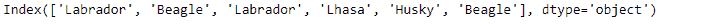
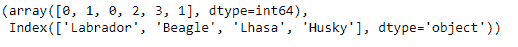
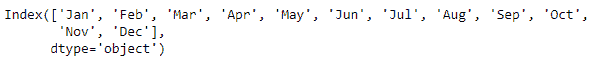
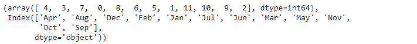

# Python | Pandas index . factorize()

> 原文:[https://www . geesforgeks . org/python-pandas-index-factorize/](https://www.geeksforgeeks.org/python-pandas-index-factorize/)

Python 是进行数据分析的优秀语言，主要是因为以数据为中心的 python 包的奇妙生态系统。 ***【熊猫】*** 就是其中一个包，让导入和分析数据变得容易多了。

熊猫 `**Index.factorize()**`函数将对象编码为枚举类型或分类变量。当重要的是识别不同的值时，此方法对于获取数组的数字表示很有用。factorize 既可以作为顶级函数 pandas.factorize()，也可以作为方法 Series.factorize()和 Index.factorize()。

> **语法:** Index.factorize(sort=False，na_sentinel=-1)
> 
> **参数:**
> **排序:**排序 uniques 和 shuffle 标签保持关系。
> **na_sentinel :** 值标记为“未找到”。
> 
> **返回:**一个整数数组，它是进入 uniques 的索引器。uniques.take(标签)将具有与 values 相同的值。

**示例#1:** 使用`Index.factorize()`函数将给定的索引值编码为分类形式。

```py
# importing pandas as pd
import pandas as pd

# Creating the Index
idx = pd.Index(['Labrador', 'Beagle', 'Labrador',
                     'Lhasa', 'Husky', 'Beagle'])

# Print the Index
idx
```

**输出:**


让我们分解给定的索引。

```py
# convert it into categorical values.
idx.factorize()
```

**输出:**

正如我们在输出中看到的，`Index.factorize()`函数已经将索引中的每个标签转换为一个类别，并为它们分配了数值。

**示例 2:** 使用`Index.factorize()`函数根据索引值的排序顺序对其进行因子分解。

```py
# importing pandas as pd
import pandas as pd

# Creating the Index
idx = pd.Index(['Jan', 'Feb', 'Mar', 'Apr', 'May', 'Jun',
               'Jul', 'Aug', 'Sep', 'Oct', 'Nov', 'Dec'])

# Print the Index
idx
```

**输出:**


让我们根据排序的顺序来分解它。只有在对索引中的值进行排序后，才会分配数值。

```py
# Factorize the sorted labels
idx.factorize(sort = True)
```

**输出:**

正如我们在输出中看到的，在给索引值赋值之前，已经对它们进行了排序。