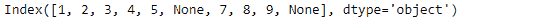
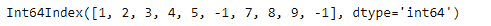
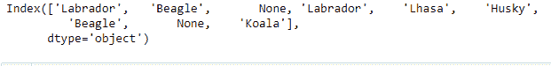
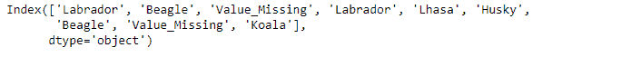

# Python | Pandas index . fill na()

> 原文:[https://www.geeksforgeeks.org/python-pandas-index-fillna/](https://www.geeksforgeeks.org/python-pandas-index-fillna/)

Python 是进行数据分析的优秀语言，主要是因为以数据为中心的 python 包的奇妙生态系统。 ***【熊猫】*** 就是其中一个包，让导入和分析数据变得容易多了。

熊猫 `**Index.fillna()**`功能用指定值填充 NA/NaN 值。它只需要一个标量值来填充索引中所有缺失的值。该函数返回一个新对象，该对象的缺失值由传递的值填充。

> **语法:** Index.fillna(值=无，向下转换=无)
> 
> **参数:**
> **值:**用于填充孔洞的标量值(例如 0)。该值不能是喜欢的列表。
> **向下转换:**项的字典- >如果可能的话要向下转换的数据类型，或者尝试向下转换为适当的相等类型的字符串“推断”(例如，如果可能的话从 float64 到 int64)
> 
> **返回:**已填充:%(klass)s

**示例#1:** 使用`Index.fillna()`函数填充索引中所有缺失的值。

```py
# importing pandas as pd
import pandas as pd

# Creating the Index
idx = pd.Index([1, 2, 3, 4, 5, None, 7, 8, 9, None])

# Print the Index
idx
```

**输出:**


让我们用-1 填充索引中所有缺失的值。

```py
# fill na values with -1
idx.fillna(-1)
```

**输出:**

正如我们在输出中看到的，`Index.fillna()`函数已经用-1 填充了所有缺失的值。该函数只接受标量值。

**示例 2:** 使用`Index.fillna()`函数填充索引中所有缺失的字符串。

```py
# importing pandas as pd
import pandas as pd

# Creating the Index
idx = pd.Index(['Labrador', 'Beagle', None, 'Labrador', 
             'Lhasa', 'Husky', 'Beagle', None, 'Koala'])

# Print the Index
idx
```

**输出:**

正如我们在输出中看到的，我们有一些缺失的值。出于数据分析的目的，我们希望用一些符合我们目的的其他指示性值来填充这些缺失值。

```py
# Fill the missing values by 'Value_Missing'
idx.fillna('Value_Missing')
```

**输出:**


正如我们在输出中看到的，索引中所有丢失的字符串都用传递的值填充了。