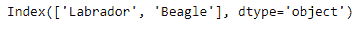

# Python | Pandas index . get _ duplicates()

> 原文:[https://www . geesforgeks . org/python-pandas-index-get _ duplicates/](https://www.geeksforgeeks.org/python-pandas-index-get_duplicates/)

Python 是进行数据分析的优秀语言，主要是因为以数据为中心的 python 包的奇妙生态系统。 ***【熊猫】*** 就是其中一个包，让导入和分析数据变得容易多了。

熊猫 `**Index.get_duplicates()**`函数提取重复的索引元素。该函数返回在索引中出现多次的索引元素的排序列表。

> **语法:** Index.get_duplicates()
> 
> **返回:**重复索引列表。

**示例#1:** 使用`Index.get_duplicates()`函数查找索引中的所有重复值。

```py
# importing pandas as pd
import pandas as pd

# Creating the Index
idx = pd.Index(['Labrador', 'Beagle', 'Labrador',
                    'Lhasa', 'Husky', 'Beagle'])

# Print the Index
idx
```

**输出:**


让我们找出索引中所有重复的值。

```py
# print the duplicated values.
idx.get_duplicates()
```

**输出:**

正如我们在输出中看到的，`Index.get_duplicates()`函数已经返回了所有在索引中出现不止一次的值。

**示例 2:** 使用`Index.get_duplicates()`功能查找索引中的所有重复项。该指数还包含`NaN`值。

```py
# importing pandas as pd
import pandas as pd

# Creating the Index
idx = pd.Index(['Labrador', 'Beagle', None, 'Labrador',
             'Lhasa', 'Husky', 'Beagle', None, 'Koala'])

# Print the Index
idx
```

**输出:**

正如我们在输出中看到的，我们有一些缺失的值。让我们看看`Index.get_duplicates()`函数是如何对待它们的。

```py
# print the duplicate values in Index
idx.get_duplicates()
```

**输出:**

多次出现的缺失值被视为重复。