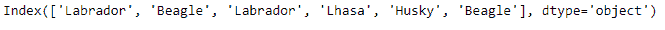
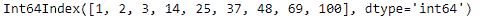

# Python | Pandas index . get _ slice _ bound()

> 原文:[https://www . geesforgeks . org/python-pandas-index-get _ slice _ bound/](https://www.geeksforgeeks.org/python-pandas-index-get_slice_bound/)

Python 是进行数据分析的优秀语言，主要是因为以数据为中心的 python 包的奇妙生态系统。 ***【熊猫】*** 就是其中一个包，让导入和分析数据变得容易多了。

熊猫 `**Index.get_slice_bound()**`函数计算对应于给定标签的切片边界，并返回值。如果 side 参数设置为左，函数返回给定标签的最左边位置，如果 side 参数设置为右，函数返回标签最右边位置的一倍。

> **语法:** Index.get_slice_bound(标签、侧面、种类)
> 
> **参数:**
> **标签:**对象
> **侧:** {【左】、【右】}
> **种类:**{【IX】、【loc】、【getitem】
> 
> **返回:边界的**值

**示例#1:** 使用`Index.get_slice_bound()`函数找到传递值的右边界。

```py
# importing pandas as pd
import pandas as pd

# Creating the Index
idx = pd.Index(['Labrador', 'Beagle', 'Labrador',
                     'Lhasa', 'Husky', 'Beagle'])

# Print the Index
idx
```

**输出:**


让我们找出传递值的切片界限。

```py
# Print the right slice bound of the passed value..
idx.get_slice_bound('Lhasa', side ='right', kind ='getitem')
```

**输出:**

正如我们在输出中看到的，`Index.get_slice_bound()`函数已经返回了 4，因为这是索引中传递值位置的第一个位置。

**例 2:** 使用`Index.get_slice_bound()`函数查找传递值的左切片边界。

```py
# importing pandas as pd
import pandas as pd

# Creating the Index
idx = pd.Index([1, 2, 3, 14, 25, 37, 48, 69, 100])

# Print the Index
idx
```

**输出:**


让我们在索引中找到值 69 的左边界。

```py
# Find the left slice bound of 69 in the Index.
idx.get_slice_bound(69, side ='left', kind ='getitem')
```

**输出:**


正如我们所看到的，函数已经返回了输出 7，因为这是传递值的位置，也是传递值左边界的位置。