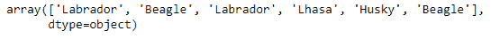
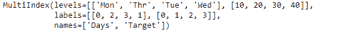
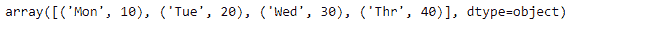

# Python | Pandas index . get _ values()

> 原文:[https://www . geesforgeks . org/python-pandas-index-get _ values/](https://www.geeksforgeeks.org/python-pandas-index-get_values/)

Python 是进行数据分析的优秀语言，主要是因为以数据为中心的 python 包的奇妙生态系统。 ***【熊猫】*** 就是其中一个包，让导入和分析数据变得容易多了。

熊猫 `**Index.get_values()**`函数以数组形式返回索引数据。对于多索引数组，它返回一维数组。

> **语法:** Index.get_values()
> 
> **返回:**索引值的一维数值数组

**示例#1:** 使用`Index.get_values()`函数将索引值作为 numpy 数组返回。

```py
# importing pandas as pd
import pandas as pd

# Creating the Index
idx = pd.Index(['Labrador', 'Beagle', 'Labrador',
                     'Lhasa', 'Husky', 'Beagle'])

# Print the Index
idx
```

**输出:**


让我们使用`Index.get_values()`函数将 Index 数据作为 numpy 数组返回。

```py
# Returns the labels of Index as numpy array
idx.get_values()
```

**输出:**

正如我们在输出中看到的，`Index.get_values()`函数已经将索引标签作为 numpy 数组返回。

**示例 2:** 在多索引数组上使用`Index.get_values()`函数。

```py
# importing pandas as pd
import pandas as pd

# Creating the MultiIndex object
midx = pd.MultiIndex.from_arrays([['Mon', 'Tue', 'Wed', 'Thr'],
                   [10, 20, 30, 40]], names =('Days', 'Target'))

# Print the MultiIndex object
midx
```

**输出:**


让我们将索引标签返回到一维 numpy 数组格式。

```py
# Convert the multi-index into one
# dimensional numpy array form.
midx.get_values()
```

**输出:**


正如我们在输出中所看到的，甚至多索引也被转换成了一维数组形式。