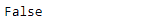

# 蟒蛇|熊猫索引.相同()

> 原文:[https://www . geesforgeks . org/python-pandas-index-同文/](https://www.geeksforgeeks.org/python-pandas-index-identical/)

Python 是进行数据分析的优秀语言，主要是因为以数据为中心的 python 包的奇妙生态系统。 ***【熊猫】*** 就是其中一个包，让导入和分析数据变得容易多了。

熊猫 `**Index.identical()**`函数确定两个索引对象是否包含相同的元素。如果它们包含相同的元素，则函数返回`True`，否则函数返回`False`，表示两个索引中包含的值不同。这与`Index.equals()`类似，但检查其他可比属性是否也相等。

> **语法:**索引.相同(其他)
> 
> **参数:**
> **其他:**指标
> 
> **返回:**布尔值

**示例#1:** 使用`Index.identical()`功能检查两个索引是否包含相同的元素，以及其他属性是否相同。

```py
# importing pandas as pd
import pandas as pd

# Creating the first Index
idx1 = pd.Index(['Labrador', 'Beagle', 'Labrador', 'Lhasa', 'Husky', 'Beagle'])

# Creating the second Index
idx2 = pd.Index(['Labrador', 'Beagle', 'Pug', 'Lhasa', 'Husky', 'Pitbull'])

# Print the first and second Index
print(idx1, '\n', idx2)
```

**输出:**


让我们检查一下这两个索引是否相同。

```py
# Checking the equality of the two Indexes
idx1.identical(idx2)
```

**输出:**

正如我们在输出中看到的，`Index.identical()`函数已经返回了`False`，表示索引不相等。

**例 2:** 使用`Index.identical()`功能检查输入指标是否一致。

```py
# importing pandas as pd
import pandas as pd

# Creating the first Index
idx1 = pd.Index(['Jan', 'Feb', 'Mar', 'Apr', 'May', 'Jun',
                'Jul', 'Aug', 'Sep', 'Oct', 'Nov', 'Dec'])

# Creating the second Index
idx2 = pd.Index(['Jan', 'Feb', 'Mar', 'Apr', 'May', 'Jun',
                'Jul', 'Aug', 'Sep', 'Oct', 'Nov', 'Dec'])

# Print the first and second Index
print(idx1, '\n', idx2)
```

**输出:**


让我们检查一下这两个索引是否相同。

```py
# test the equality
idx1.identical(idx2)
```

**输出:**


该函数已返回`True`，表示两个索引彼此相同。