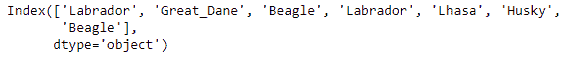
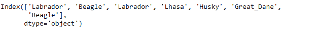

# Python | Pandas index . insert()

> 原文:[https://www.geeksforgeeks.org/python-pandas-index-insert/](https://www.geeksforgeeks.org/python-pandas-index-insert/)

Python 是进行数据分析的优秀语言，主要是因为以数据为中心的 python 包的奇妙生态系统。 ***【熊猫】*** 就是其中一个包，让导入和分析数据变得容易多了。

熊猫 `**Index.insert()**`功能制作新索引，在位置插入新项目。这个函数对于负值也遵循 Python `list.append()`语义。如果负值被传递，那么它从另一端开始。

> **语法:**索引.插入(loc，item)
> 
> **参数:**
> **loc :** int
> **项:**对象
> 
> **返回:** new_index : Index

**示例#1:** 使用`Index.insert()`函数在索引中插入一个新值。

```
# importing pandas as pd
import pandas as pd

# Creating the Index
idx = pd.Index(['Labrador', 'Beagle', 'Labrador',
                     'Lhasa', 'Husky', 'Beagle'])

# Print the Index
idx
```

**输出:**

现在在第一个索引处插入‘大丹犬’。

```
# Inserting a value at the first position in the index.
idx.insert(1, 'Great_Dane')
```

**输出:**


正如我们在输出中看到的那样，`Index.insert()`函数已经在所需的位置插入了传递的值。

**示例 2:** 使用`Index.insert()`函数在索引中倒数第二个位置的索引中插入一个值。

```
# importing pandas as pd
import pandas as pd

# Creating the Index
idx = pd.Index(['Labrador', 'Beagle', 'Labrador',
                     'Lhasa', 'Husky', 'Beagle'])

# Print the Index
idx
```

**输出:**


现在在最后一个索引的第一个位置插入“大丹犬”。

```
# Inserting a value at the first position in the index.
idx.insert(-1, 'Great_Dane')
```

**输出:**

正如我们在输出中看到的，传递的值已经被插入到索引中的期望位置。