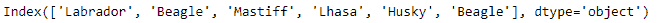
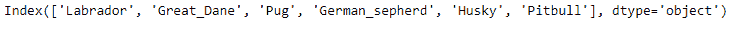
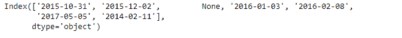
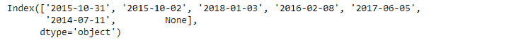

# Python | Pandas index . intersection()

> 原文:[https://www . geesforgeks . org/python-pandas-index-intersection/](https://www.geeksforgeeks.org/python-pandas-index-intersection/)

Python 是进行数据分析的优秀语言，主要是因为以数据为中心的 python 包的奇妙生态系统。 ***【熊猫】*** 就是其中一个包，让导入和分析数据变得容易多了。

熊猫 `**Index.intersection()**`功能形成两个索引对象的交集。这将返回一个新的索引，其中包含该索引和其他索引共有的元素，并保持调用索引的顺序。

> **语法:**索引.交集(其他)
> 
> **参数:**
> **其他:**指数或阵列状
> 
> **返回:**交集:索引

**示例#1:** 使用`Index.intersection()`函数查找两个索引的集合交集。

```py
# importing pandas as pd
import pandas as pd

# Creating the first Index
idx1 = pd.Index(['Labrador', 'Beagle', 'Mastiff', 
                     'Lhasa', 'Husky', 'Beagle'])

# Creating the second Index
idx2 = pd.Index(['Labrador', 'Great_Dane', 'Pug',
           'German_sepherd', 'Husky', 'Pitbull'])

# Print the first and second Index
print(idx1, '\n', idx2)
```

**输出:**



现在我们找到两个索引的集合交集。

```py
# Find the elements common to both the Indexes
idx2.intersection(idx1)
```

**输出:**


正如我们在输出中看到的，`Index.intersection()`函数返回了两个索引的交集。标签的顺序根据调用索引进行维护。

**例 2:** 使用`Index.intersection()`函数查找两个索引的集合交集。该指数包含`NaN`值。

```py
# importing pandas as pd
import pandas as pd

# Creating the first Index
idx1 = pd.Index(['2015-10-31', '2015-12-02', None, '2016-01-03', 
                      '2016-02-08', '2017-05-05', '2014-02-11'])

# Creating the second Index
idx2 = pd.Index(['2015-10-31', '2015-10-02', '2018-01-03',
           '2016-02-08', '2017-06-05', '2014-07-11', None])

# Print the first and second Index
print(idx1, '\n', idx2)
```

**输出:**



现在我们找到 idx1 和 idx2 的交点。

```py
# find intersection and maintain 
# ordering of labels based on idx1
idx1.intersection(idx2)
```

**输出:**

**注:**两个指标的缺失值被认为是共同的。