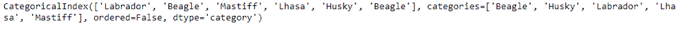
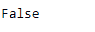

# Python | Pandas index . is _ classic()

> 原文:[https://www . geesforgeks . org/python-pandas-index-is _ classic/](https://www.geeksforgeeks.org/python-pandas-index-is_categorical/)

Python 是进行数据分析的优秀语言，主要是因为以数据为中心的 python 包的奇妙生态系统。 ***【熊猫】*** 就是其中一个包，让导入和分析数据变得容易多了。

熊猫 `**Index.is_categorical()**`功能检查索引是否包含分类数据。分类变量代表可以分组的数据类型。分类变量的例子有种族、性别、年龄组和教育水平。

> **语法:**index . is _ classic()
> 
> **参数:**不取任何参数。
> 
> **如果索引是分类的，则返回:**真。

**示例#1:** 使用`Index.is_categorical()`功能检查输入索引是否分类。

```py
# importing pandas as pd
import pandas as pd

# Creating the categorical Index
idx = pd.Index(['Labrador', 'Beagle', 'Mastiff', 'Lhasa',
                    'Husky', 'Beagle']).astype('category')

# Print the Index
idx
```

**输出:**


现在我们发现 idx 标签是否是分类的。

```py
# Find whether idx1 is categorical or not.
idx.is_categorical()
```

**输出:**

该函数返回 true，表示索引中包含的值是绝对的。

**示例#2:** 使用`Index.is_categorical()`函数查找索引中包含的值是否是分类的。

```py
# importing pandas as pd
import pandas as pd

# Creating the Index
idx = pd.Index(['2015-10-31', '2015-12-02', None, '2016-01-03',
                      '2016-02-08', '2017-05-05', '2014-02-11'])

# Print the Index
idx
```

**输出:**


现在我们检查 idx 中的标签是否是分类的。

```py
# test whether idx is having categorical values.
idx.is_categorical()
```

**输出:**


正如我们在输出中看到的，该函数返回了`False`，表明这些值在 idx 索引中不是绝对的。