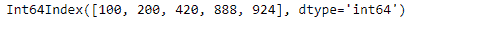
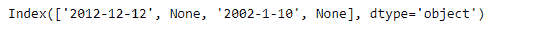
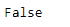

# Python | Pandas index . is _ 单调 _ 递增

> 原文:[https://www . geesforgeks . org/python-pandas-index-is _ 单调 _ 递增/](https://www.geeksforgeeks.org/python-pandas-index-is_monotonic_increasing/)

熊猫索引是一个实现有序的、可切片的集合的不可变数组。它是存储所有熊猫对象的轴标签的基本对象。

熊猫 `**Index.is_monotonic_increasing**`属性返回`True`如果给定索引对象中的基础数据单调递增，则返回`False`。

> **语法:**index . is _ 单调 _ 递增
> 
> **参数:**无
> 
> **返回:**布尔值

**示例#1:** 使用`Index.is_monotonic_increasing`属性找出给定索引对象中的底层数据是否单调增加。

```py
# importing pandas as pd
import pandas as pd

# Creating the index
idx = pd.Index([100, 200, 420, 888, 924])

# Print the index
print(idx)
```

**输出:**


现在我们将使用`Index.is_monotonic_increasing`属性来找出给定 Index 对象中的底层数据是否单调递增。

```py
# check if the values in the Index
# are monotonically increasing
result = idx.is_monotonic_increasing

# Print the result
print(result)
```

**输出:**

正如我们在输出中看到的，`Index.is_monotonic_increasing`属性已经返回了`True`，表示给定 Index 对象的底层数据是单调递增的。

**示例 2 :** 使用`Index.is_monotonic_increasing`属性找出给定索引对象中的底层数据是否单调增加。

```py
# importing pandas as pd
import pandas as pd

# Creating the index
idx = pd.Index(['2012-12-12', None, '2002-1-10', None])

# Print the index
print(idx)
```

**输出:**


现在我们将使用`Index.is_monotonic_increasing`属性来找出给定 Index 对象中的底层数据是否单调递增。

```py
# check if the values in the Index
# are monotonically increasing
result = idx.is_monotonic_increasing

# Print the result
print(result)
```

**输出:**

正如我们在输出中看到的，`Index.is_monotonic_increasing`属性已经返回了`False`，表明给定 Index 对象的底层数据不是单调递增的。